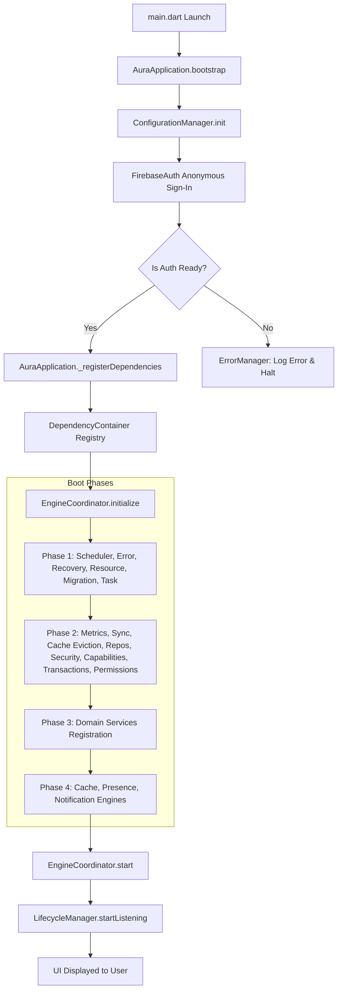
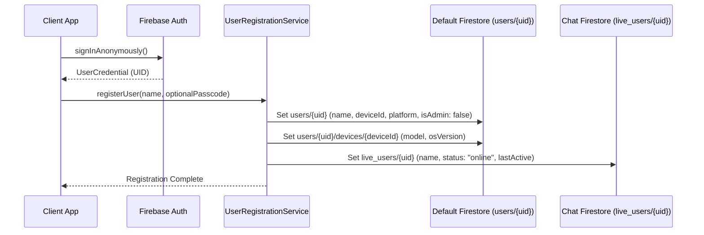
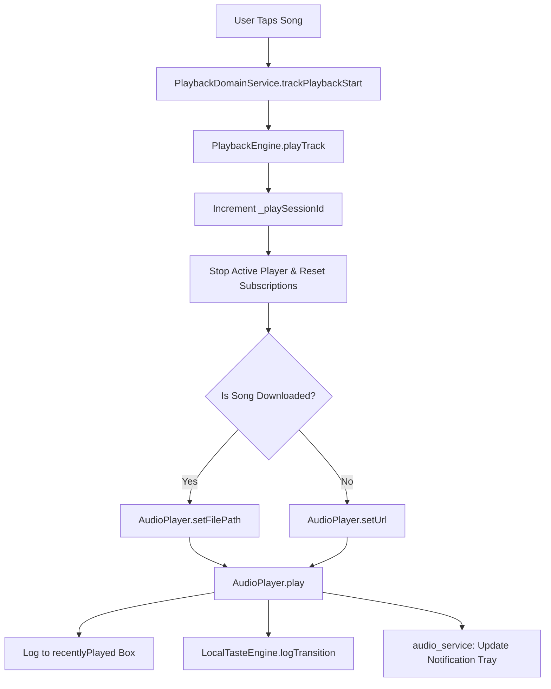
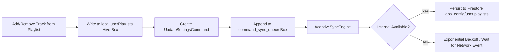
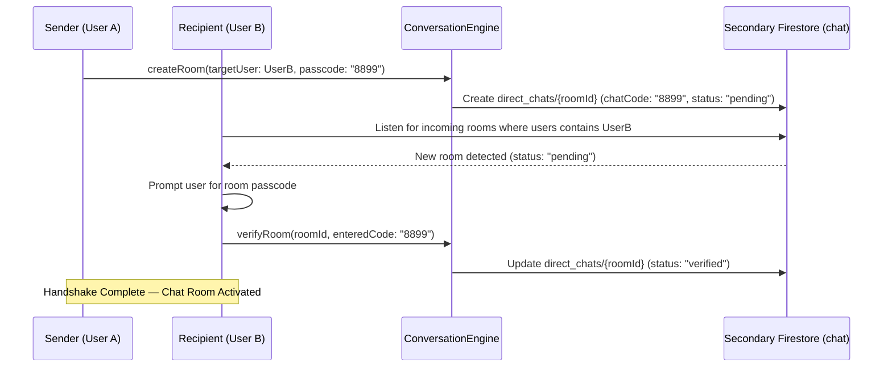
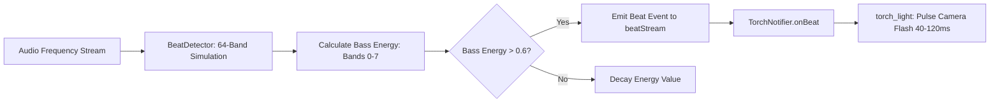

# 🎵 Aura Player (`free_play`) — Complete Technical & Architectural Specification

> **Aura Player** is an advanced, ad-free, offline-first music streaming, recommendation, and secure peer-to-peer communication application built with Flutter, Riverpod, Just Audio, Hive, and a custom Multi-Instance Cloud Firestore architecture.

---

## 📑 Table of Contents
1. [Overview & Highlights](#-overview--highlights)
2. [Architectural Principles & System Design](#-architectural-principles--system-design)
3. [Multi-Database Firestore Architecture](#-multi-database-firestore-architecture)
4. [Directory & File Structure](#-directory--file-structure)
5. [End-to-End Functional Modules & Workflows](#-end-to-end-functional-modules--workflows)
   - [1. Application Kernel & Multi-Phase Boot Sequence](#1-application-kernel--multi-phase-boot-sequence)
   - [2. User Registration, Authentication & Identity Discovery](#2-user-registration-authentication--identity-discovery)
   - [3. Audio Streaming, Session Management & Background Playback](#3-audio-streaming-session-management--background-playback)
   - [4. Zero-Cost Multi-Provider Failover Search & YouTube-Style Intelligence](#4-zero-cost-multi-provider-failover-search--youtube-style-intelligence)
   - [5. Offline-First Playlist Management & Sync Engine](#5-offline-first-playlist-management--sync-engine)
   - [6. Multi-Format YouTube Import, Quality Selector & Offline Downloader](#6-multi-format-youtube-import-quality-selector--offline-downloader)
   - [7. Secret Chat Room Connection & Passcode Handshake](#7-secret-chat-room-connection--passcode-handshake)
   - [8. Real-Time Chat Messaging, Soft-Deletes & Database Pruning](#8-real-time-chat-messaging-soft-deletes--database-pruning)
   - [9. Real-Time Presence & Focus Tracking Engine](#9-real-time-presence--focus-tracking-engine)
   - [10. Admin Console, Diagnostics & ML Training](#10-admin-console-diagnostics--ml-training)
   - [11. Resource Manager, Hardware Adaptation & Cache Eviction](#11-resource-manager-hardware-adaptation--cache-eviction)
   - [12. Real-Time Hardware Strobe Light Beat Sync](#12-real-time-hardware-strobe-light-beat-sync)
   - [13. Synchronized Scrolling Lyrics Engine](#13-synchronized-scrolling-lyrics-engine)
   - [14. Local Taste Engine & Recommendation Matrix](#14-local-taste-engine--recommendation-matrix)
   - [15. Regional IP Geolocation & Search Localization](#15-regional-ip-geolocation--search-localization)
   - [16. Push Notification & Event Dispatcher Engine](#16-push-notification--event-dispatcher-engine)
   - [17. Device Capability Profiling & Memory Scaling](#17-device-capability-profiling--memory-scaling)
6. [Complete Codebase Index: Classes, Services, Engines & Functions](#-complete-codebase-index)
7. [External APIs & Remote Data Sources](#-external-apis--remote-data-sources)
8. [Firestore Database Schemas & Data Models](#-firestore-database-schemas--data-models)
9. [State Management & Riverpod Providers](#-state-management--riverpod-providers)
10. [Local Storage & Hive Cache Hierarchy](#-local-storage--hive-cache-hierarchy)
11. [Setup, Build & Environment Configuration](#-setup-build--environment-configuration)
12. [Security, Concurrency & Stability Guarantees](#-security-concurrency--stability-guarantees)

---

## 🌟 Overview & Highlights

Aura Player (`free_play`) delivers a high-fidelity, ad-free streaming experience with local caching, synchronized lyrics, audio visualizers, and hardware-level strobe synchronization, paired with a hidden, passcode-protected direct messaging layer.

### Key Capabilities:
- **Audio Engine:** High-performance audio playback powered by `just_audio` and `audio_service` with session locking, glitchless track switching, auto-skipping, and lock-screen controls.
- **Zero-Cost Multi-Provider Failover Search:** 3-Tier resilient search chain (Tier 0: Hive Cache, Tier 1: MongoDB Atlas Search, Tier 2: Algolia Free Tier, Tier 3: Client-Side Fuzzy Engine) with automatic 3s timeout failover and 0 cloud reads on offline fallback.
- **YouTube-Style Relevance & Ranking:** Multi-factor ranking formula balancing text similarity (0.40), global play velocity (0.30), user taste affinity (0.20), and market trends (0.10) with typo tolerance (Levenshtein & Jaro-Winkler) and N-gram Firestore tokenization.
- **Multi-Format YouTube Extractor:** Multi-format audio stream extraction with dynamic bitrate selection (High ~320 kbps, Standard ~128 kbps, Data Saver ~64 kbps), real-time size estimates, and Wi-Fi vs Cellular data saver integration.
- **Offline-First Storage:** 3-tier cache hierarchy (L1 In-Memory, L2 Encrypted Hive Boxes, L3 Multi-Database Firestore) with background synchronization.
- **Secret P2P Chat Protocol:** Isolated chat subsystem running on a dedicated secondary Firestore database (`databaseId: 'chat'`) with passcode-negotiated room verification.
- **Hardware Integration:** Real-time beat-detection algorithm translating audio frequency spikes directly into physical camera flash strobe pulses.
- **Dynamic Diagnostics & Self-Healing:** Monitors RAM, battery level, network latency, and cache limits, adapting sync intervals and thread pools dynamically.

---

## 🏗️ Architectural Principles & System Design

The application follows Clean Architecture principles combined with an Event-Driven Engine Coordinator pattern:

```
┌────────────────────────────────────────────────────────┐
│                   Presentation Layer                   │
│   (Screens, Riverpod Providers, Neumorphic/Glass UI)   │
└───────────────────────────┬────────────────────────────┘
                            │
┌───────────────────────────▼────────────────────────────┐
│                      Domain Layer                      │
│     (Domain Services, Core Entities, Repositories)     │
└───────────────────────────┬────────────────────────────┘
                            │
┌───────────────────────────▼────────────────────────────┐
│                     Feature Engines                    │
│    (Music Engines, Chat Engines, Admin ML Engines)     │
└───────────────────────────┬────────────────────────────┘
                            │
┌───────────────────────────▼────────────────────────────┐
│                   Core Infrastructure                  │
│  (Kernel Boot, Sync Engine, Security, Task, Recovery)  │
└───────────────────────────┬────────────────────────────┘
                            │
┌───────────────────────────▼────────────────────────────┐
│                       Data Layer                       │
│ (Remote Adapters, Local Hive DB, Dual Firestore DBs)   │
└────────────────────────────────────────────────────────┘
```

### Key Subsystems:
- **Dependency Injection:** Centralized [DependencyContainer](file:///d:/free_play/lib/core/di/dependency_container.dart) providing singleton and factory lifecycle resolution.
- **Command & Event Bus:** [AppCommand](file:///d:/free_play/lib/core/commands/app_command.dart) pipeline synchronized via [AdaptiveSyncEngine](file:///d:/free_play/lib/core/sync/adaptive_sync_engine.dart) and broadcasted through [EventDispatcher](file:///d:/free_play/lib/core/events/event_dispatcher.dart).
- **Fail-Closed Security Model:** Passcode and authorization rules check live Firestore instances via `Source.server` before access is granted.

---

## 🗄️ Multi-Database Firestore Architecture

Aura Player routes data across **two separate Cloud Firestore databases** within the same Firebase project:

```
                       ┌───────────────────────────────┐
                       │      Firebase Project         │
                       └──────┬─────────────────┬──────┘
                              │                 │
              ┌───────────────▼──┐           ┌──▼────────────────┐
              │ Default Database │           │   Chat Database   │
              │   ((default))    │           │ (databaseId: chat)│
              └───────┬──────────┘           └──┬────────────────┘
                      │                         │
     ├── users/{uid}                            ├── live_users/{uid}
     ├── users/{uid}/devices/{deviceId}         ├── direct_chats/{roomId}
     ├── app_config/map_settings                └── direct_chats/{roomId}/messages/{msgId}
     ├── ml_training/rules
     └── pending_deliveries/{uid}
```

> **Important**: The Chat Service strictly connects to `FirebaseFirestore.instanceFor(app: Firebase.app(), databaseId: 'chat')`. This segregation protects chat metadata, session presence, and direct messages from general application operations.

---

## 📁 Directory & File Structure

```
d:/free_play/
├── .env / .env.example              # Environment variables & API keys
├── pubspec.yaml                     # Dependencies & asset declarations
├── firestore.rules                  # Firestore multi-database security rules
├── lib/
│   ├── main.dart                    # Application entry point & Flutter binding
│   ├── web_stubs.dart               # Platform fallback stubs for web/desktop
│   ├── config/                      # API keys & integration configurations
│   │   ├── lastfm_config.dart
│   │   └── spotify_config.dart
│   ├── core/                        # Core infrastructure & engine kernel
│   │   ├── cache/                   # Cache eviction engine & policies
│   │   ├── capability/              # Device hardware & RAM capability profiler
│   │   ├── commands/                # CQRS command patterns (Chat, Admin, App)
│   │   ├── config/                  # Configuration registry & keys
│   │   ├── constants/               # Global constants & dimensions
│   │   ├── di/                      # Dependency injection service locator
│   │   ├── events/                  # Event bus & domain event declarations
│   │   ├── kernel/                  # Application bootstrap, engine coordinator, lifecycle
│   │   ├── migration/               # Hive / database schema migration engine
│   │   ├── network/                 # Network client wrappers & interceptors
│   │   ├── permission/              # Role-based access control & permissions
│   │   ├── provider/                # Core Riverpod & state management bridges
│   │   ├── security/                # Security policy engines & encryption
│   │   ├── services/                # Hardware beat detector & utilities
│   │   ├── shared/                  # Error, Metrics, Recovery, Resource & Scheduler managers
│   │   ├── sync/                    # Adaptive offline-first sync engine
│   │   ├── task/                    # Background async task queue manager
│   │   └── transaction/             # Atomic transaction coordinator
│   ├── data/                        # Data access, datasources, models & services
│   │   ├── datasources/             # Remote API clients & local Hive wrappers
│   │   ├── models/                  # Freezed/JSON data transfer objects & entities
│   │   ├── repositories/            # Implementation of domain repositories
│   │   └── services/                # 31 specialized services (Audio, Chat, Search, etc.)
│   ├── domain/                      # Domain business logic & contract definitions
│   │   ├── entities/                # Core domain models
│   │   ├── repositories/            # Repository contracts & interfaces
│   │   └── services/                # Domain orchestrators (Playback, Conversation, Search, User)
│   ├── features/                    # Feature engines & logic clusters
│   │   ├── admin/                   # Analytics, Audit, Config, User Management, ML engines
│   │   ├── chat/                    # Message, Presence, Cache, Conversation, Security engines
│   │   └── music/                   # Playback, Queue, Download, Search Aggregator engines
│   └── presentation/                # UI Presentation layer
│       ├── providers/               # 17 Riverpod state notifiers & streams
│       ├── screens/                 # 17 Complete application screens
│       └── widgets/                 # 21 Reusable widgets (Visualizer, Mini Player, Lyrics, etc.)
```

---

## 🔄 End-to-End Functional Modules & Workflows

### 1. Application Kernel & Multi-Phase Boot Sequence
Coordinates the deterministic startup of all sub-systems across 4 isolated dependency phases to eliminate race conditions.



- **Primary Classes & Methods:**
  - `AuraApplication.bootstrap()`: Initializes Flutter engine, Hive storage boxes, Firebase instances, and triggers Phase 1–4 engines.
  - `EngineCoordinator.initialize()` & `EngineCoordinator.start()`: Sequentially boots and starts registered `IEngine` instances.
  - `ConfigurationManager.init()`: Fetches settings from Firestore `app_config/map_settings` with failover to local Hive cache.

---

### 2. User Registration, Authentication & Identity Discovery
Implements frictionless anonymous authentication with dual-database user profile registration.



- **Primary Classes & Methods:**
  - `UserRegistrationService.registerUser(String name, {String? passcode})`: Orchestrates dual-write registration across both databases.
  - `UserRegistrationService.syncPresence({required bool isOnline, String? currentRoomId})`: Maintains real-time active status.
  - `LocalChatService.getChatUsersOnce()`: Reads active users from both Firestore instances using `Source.server`, deduplicates by UID, and sorts online users first.

---

### 3. Audio Streaming, Session Management & Background Playback
A high-resilience audio engine supporting local and remote streams, queue management, lockscreen notification playback controls, and session guard tokens to prevent isolate crashes during rapid track switching.



- **Primary Classes & Methods:**
  - `AudioPlayerHandler`: Custom `BaseAudioHandler` managing system audio focus, lockscreen media controls, and notification tray integration.
  - `PlaybackEngine.playTrack(Song song)`: Dispatches play commands to the audio player handler.
  - `AudioService.skipToNext()` / `AudioService.skipToPrevious()`: Advances or rewinds the active playback queue.
  - `QueueManager`: Manages playlist queues, shuffle algorithms (Fisher-Yates), and repeat modes (`off`, `all`, `one`).

---

### 4. Zero-Cost Multi-Provider Failover Search & YouTube-Style Intelligence
Chains multiple search providers into a high-resiliency failover architecture, coupled with client-side typo tolerance, Firestore N-gram tokenization, and multi-factor YouTube relevance ranking.

```
                       [Flutter App: Search Query Input]
                                      │
                         (Debounce 300ms + Local Cache Check)
                                      │
            ┌─────────────────────────┴─────────────────────────┐
            ▼                                                   ▼
   [Local Hive Cache Hit]                             [Local Hive Cache Miss]
   (0ms Latency - 0 Cost)                                       │
                                                                ▼
                                                 [Tier 1: MongoDB Atlas Search]
                                                 (Free M0 Cluster - Primary)
                                                                │
                                                     ┌──────────┴──────────┐
                                                     ▼                     ▼
                                                 (Success)              (Failure / Timeout 3s)
                                                     │                     │
                                                     ▼                     ▼
                                              Return Results     [Tier 2: Algolia Free Tier]
                                                                 (10k Search Quota - Secondary)
                                                                           │
                                                                 ┌─────────┴─────────┐
                                                                 ▼                   ▼
                                                             (Success)          (Failure / Timeout 3s)
                                                                 │                   │
                                                                 ▼                   ▼
                                                          Return Results     [Tier 3: Client-Side Fuzzy Engine]
                                                                             (100% Offline Hardware Fallback)
```

#### YouTube-Style Relevance & Ranking Formula:
Returned candidates are scored dynamically on the client using a multi-factor equation:
$$\text{Final Score} = (\text{Text Similarity} \times 0.40) + (\text{Global Play Velocity} \times 0.30) + (\text{User Taste Affinity} \times 0.20) + (\text{Market Trend Boost} \times 0.10)$$

- **Primary Classes & Methods:**
  - `FailoverSearchCoordinator`: Manages provider execution order `[MongoAtlasSearchProvider, AlgoliaSearchProvider, ClientSideFuzzySearchProvider]` with 3-second timeouts and telemetry event emission.
  - `MongoAtlasSearchProvider`: Tier 1 Primary Cloud Search using MongoDB Atlas Apache Lucene autocomplete and fuzzy stages (`maxEdits: 2`).
  - `AlgoliaSearchProvider`: Tier 2 Cloud Backup using Algolia REST API free quota.
  - `ClientSideFuzzySearchProvider`: Tier 3 Absolute Fail-Safe executing Levenshtein distance & token overlap on local Hive boxes (0 cloud reads, 100% offline).
  - `SearchCacheManager`: Key-value query caching in Hive (`search_cache_box`) with LRU eviction and 24-hour TTL (0ms latency, 0 cost).
  - `NGramTokenizer`: Text normalization and prefix edge-gram generator (2-10 chars) for indexing records into Firestore `searchTokens` arrays.
  - `StringSimilarity`: Implements Levenshtein Distance and Jaro-Winkler string similarity for typo tolerance.
  - `YouTubeRelevanceRanker`: Multi-factor relevance scoring engine.
  - `FirestoreCachedSearchService`: Debounced search service querying Firestore `array-contains` with client-side ranking.
  - `SearchFailoverNotifier` / `searchFailoverProvider`: Riverpod state management driving the UI and `SearchTierIndicator` badges.

---

### 5. Offline-First Playlist Management & Sync Engine
Enables instant local playlist modifications with guaranteed background synchronization.



- **Primary Classes & Methods:**
  - `PlaylistProvider`: Riverpod `StateNotifier` managing active, custom, and favorite playlists.
  - `AdaptiveSyncEngine.processQueue()`: Dequeues pending commands from Hive, executes remote transactions, and handles offline retry cycles.
  - `AppCommandFactory.createCommand(type, payload)`: Serializes/deserializes command mutations for persistence.

---

### 6. Multi-Format YouTube Import, Quality Selector & Offline Downloader
Streams and downloads YouTube tracks with user-selected audio resolution and bitrate tiers, optimized for bandwidth and storage savings.

```
                  [Import YouTube Link / Playlist]
                                 │
                   (POST /api/youtube/extract)
                                 │
                 [Parse Multi-Format Audio Streams]
             ┌───────────────────┼───────────────────┐
             ▼                   ▼                   ▼
      [High Quality]     [Standard Quality]   [Data Saver]
       ~320 kbps m4a       ~128 kbps m4a      ~64 kbps m4a
       (~9 MB/track)       (~3.8 MB/track)    (~1.9 MB/track)
             └───────────────────┬───────────────────┘
                                 │
                     [User Selects Resolution]
                   (Persist in user_settings_box)
                                 │
                   ┌─────────────┴─────────────┐
                   ▼                           ▼
          [Direct Streaming]          [Offline Download]
      (LockCachingAudioSource)    (GET /api/youtube/download)
                   │                           │
                   ▼                           ▼
      (Auto Data Saver on Mobile)  (Tag Bitrate into offline_songs)
```

- **Primary Classes & Methods:**
  - `YouTubeExtractorService`: Dispatches multi-format extraction requests to the Node.js microservice and caches results in `yt_imports_cache`.
  - `YouTubeAudioFormat`: Represents quality tiers, bitrates, format IDs (`140`, `139`, `249`), and estimated file sizes in MB.
  - `QualitySettingsService`: Manages persistent user preferences in `user_settings_box` (`default_download_quality`, `data_saver_on_cellular`).
  - `ImportLinkModal`: Interactive modal sheet with real-time bitrate selector cards and one-tap download/play actions.
  - `DownloadService.downloadSong()`: Downloads binary streams with selected format IDs and tags bitrate metadata into `offline_songs` Hive box.
  - `OfflineStorageService.downloadSong()`: Manages sandbox file storage, album art caching, and local library indexing.
  - `AudioService`: Dynamically adapts streaming bitrates based on active network connection (Wi-Fi vs Cellular).

---

### 7. Secret Chat Room Connection & Passcode Handshake
Enables isolated direct messaging channels over the secondary Firestore instance with custom passcodes.



- **Primary Classes & Methods:**
  - `ConversationEngine.createRoom(String targetUserId, String passcode)`: Instantiates a chat room document in `direct_chats/{roomId}` with `chatCodeStatus: "pending"`.
  - `ConversationEngine.verifyRoom(String roomId, String passcode)`: Validates entered code and upgrades room status to `"verified"`.
  - `ChatRoomScreen`: Handles live message streaming, chat encryption, and passcode entry.

---

### 8. Real-Time Chat Messaging, Soft-Deletes & Database Pruning
Provides messaging capabilities including text editing, soft-deletion, starring, and automated lifecycle pruning.

- **Primary Classes & Methods:**
  - `MessageEngine.sendMessage(String roomId, String text)`: Dispatches messages to local L1 cache, L2 Hive, and enqueues `CreateMessageCommand`.
  - `MessageEngine.deleteMessage(String roomId, String messageId)`: Executes soft-delete (`isDeleted: true`, text replaced with *"This message was deleted"*).
  - `MessageEngine.pruneExpiredMessages(Duration expiry)`: Hourly cron job triggered by `SchedulerEngine` that archives or purges non-starred messages older than the retention threshold (default: 24h).

---

### 9. Real-Time Presence & Focus Tracking Engine
Monitors application lifecycle events to report active status and suppress redundant notification sounds.

- **Primary Classes & Methods:**
  - `LifecycleManager`: Listens to Flutter `AppLifecycleState` transitions (`resumed`, `paused`, `detached`).
  - `PresenceEngine.pause()` / `PresenceEngine.resume()`: Updates `live_users/{uid}` in Chat Firestore (`status: "online"` vs `"offline"`, `lastActive`).
  - `LocalChatService.updateCurrentRoom(String? roomId)`: Tracks the active chat screen to suppress incoming push notifications when the user is already viewing the conversation.

---

### 10. Admin Console, Diagnostics & ML Training
Provides system administration capabilities including metrics review, synonym dictionary training, user management, and passcode configuration.

- **Primary Classes & Methods:**
  - `SecurityEngine.validateAdminAccess(String passcode)`: Validates the entered admin password and checks `isAdmin: true` in the user's Firestore record.
  - `SearchIntelligenceEngine.trainSynonym(String alias, String canonical)`: Registers search aliases in Hive and syncs rules to Firestore.
  - `UserManagementEngine.deleteUser(String uid)`: Cascades user account deletion across `users/{uid}`, `pending_deliveries/{uid}`, and `live_users/{uid}`.

---

### 11. Resource Manager, Hardware Adaptation & Cache Eviction
Optimizes application performance based on available RAM, battery status, and network conditions.

- **Adaptive Sync Intervals:**
  - **Wi-Fi:** 15 seconds
  - **Cellular Data:** 45 seconds
  - **Battery Saver Active:** 90 seconds
- **Cache Eviction Tiers (P1 to P5):**
  - **P1 (Active Chat):** Never evicted
  - **P2 (Pinned Chats):** Never evicted
  - **P3 (Starred Messages):** Never evicted
  - **P4 (Archived Chats):** Eligible for eviction on low memory
  - **P5 (Stale Messages > 7 Days):** Automatically purged when cache exceeds thresholds

---

### 12. Real-Time Hardware Strobe Light Beat Sync
Translates audio frequency analysis into physical camera flashlight strobe pulses.



- **Primary Classes & Methods:**
  - `BeatDetector`: Processes audio playback position and generates simulated 64-band frequency arrays.
  - `TorchNotifier.toggleBeatSync(bool enabled)`: Binds beat stream events to camera flashlight hardware pulses.

---

### 13. Synchronized Scrolling Lyrics Engine
Retrieves time-stamped lyrics from multiple providers and syncs line highlighting to audio playback.

- **Provider Fallback Chain:**
  1. **LRCLIB (Primary):** Searches using track duration and title metadata.
  2. **Lyrics.ovh:** Plain-text lyrics fallback.
  3. **LyricaV2 (HuggingFace):** AI-extracted timestamped lyrics.
  4. **Gaama Workers API:** Scraped and sanitized lyric streams.
- **Primary Classes & Methods:**
  - `LyricsService.fetchLyrics(String trackName, String artistName, {Duration? duration})`: Runs the fallback search chain and parses `[mm:ss.xx]` timestamps.
  - `SynchronizedLyricsWidget`: Renders smooth auto-scrolling lyrics highlighted in real-time.

---

### 14. Local Taste Engine & Recommendation Matrix
Generates on-device personalized recommendations without tracking user data on external servers.

- **Affinity Scoring Formula:**
  - **Track Co-occurrence:** $+5.0$ per transition in `track_transitions` box.
  - **Artist Affinity:** $+1.5$ if the artist is in the user's top 10 most-played.
  - **Playlist Affinity:** $+3.0$ for Favorites, $+2.0$ for custom playlists.
  - **Skip Penalty:** $-2.0$ for tracks skipped within the first 30 seconds.
- **Primary Classes & Methods:**
  - `LocalTasteEngine.logPlay(String trackId, String artistId)`: Updates listening history and artist play frequencies.
  - `LocalTasteEngine.logTransition(String fromTrackId, String toTrackId)`: Updates track co-occurrence matrices.
  - `MLRecommendationEngine.getRecommendations(String currentTrackId)`: Generates and ranks suggested tracks.

---

### 15. Regional IP Geolocation & Search Localization
Queries IP-based location data on startup to configure regional search filters.

- **Primary Classes & Methods:**
  - `IpLocationService.fetchLocation()`: Queries `http://ip-api.com/json/` for geographic coordinates and country codes.
  - `HybridSearchService`: Uses location metadata to localize Spotify and regional music search results.

---

### 16. Push Notification & Event Dispatcher Engine
Handles FCM token registration and silent background event processing.

- **Primary Classes & Methods:**
  - `FcmTokenService.init()`: Requests push permissions and registers the FCM token in `live_users/{uid}`.
  - `NotificationEngine`: Listens to `MessageCreatedEvent` and triggers local sounds or badges.
  - `EventDispatcher.dispatch(AppEvent event)`: Broadcasts events across application engines.

---

### 17. Device Capability Profiling & Memory Scaling
Profiles device RAM on launch to configure memory caches and search concurrency.

- **Primary Classes & Methods:**
  - `DeviceCapabilityEngine.initialize()`: Evaluates total RAM.
  - **Low-Memory Profile (< 2GB RAM):** Cache limit set to 50 messages; search concurrency restricted to 1 thread.
  - **Standard Profile (>= 2GB RAM):** Cache limit set to 200 messages; search concurrency allows up to 3 parallel threads.

---

## 💻 Complete Codebase Index

### Core Services & Engines (`lib/data/services/` & `lib/features/`)

| Class / Service Name | File Path | Key Functions & Responsibilities |
| :--- | :--- | :--- |
| `FailoverSearchCoordinator` | `lib/core/search/failover_search_coordinator.dart` | `executeSearch(query)` across MongoDB Atlas -> Algolia -> Local Fuzzy Engine with 3s timeouts. |
| `FirestoreCachedSearchService` | `lib/core/search/services/firestore_cached_search_service.dart` | `debouncedSearch()`, `search()` with Hive cache checks and Firestore N-gram array-contains. |
| `YouTubeRelevanceRanker` | `lib/core/search/ranking/youtube_relevance_ranker.dart` | `rank()` with 4-factor scoring (Text 0.40, Velocity 0.30, Taste 0.20, Trend 0.10). |
| `NGramTokenizer` | `lib/core/search/normalization/ngram_tokenizer.dart` | `generateSearchTokens()`, `normalize()` for Firestore document indexing. |
| `StringSimilarity` | `lib/core/search/ranking/string_similarity.dart` | `levenshteinSimilarity()`, `jaroWinkler()`, `fuzzyScore()` for typo tolerance. |
| `SearchCacheManager` | `lib/core/search/search_cache_manager.dart` | `getCachedResults()`, `cacheResults()`, `clearCache()` in Hive `search_cache_box`. |
| `QualitySettingsService` | `lib/data/services/quality_settings_service.dart` | `getPreferredDownloadQuality()`, `setPreferredDownloadQuality()`, `isDataSaverOnCellularEnabled()`. |
| `YouTubeExtractorService` | `lib/data/services/youtube_extractor_service.dart` | `extractTrackWithFormats()`, `getDownloadUrl()`, `getFreshStreamUrl()` with multi-format audio tiers. |
| `AudioPlayerHandler` | `lib/data/services/audio_service.dart` | `play()`, `pause()`, `stop()`, `skipToNext()`, `skipToPrevious()`, `seek()`, `_playSong()` with session-guard tokens. |
| `HybridSearchService` | `lib/data/services/hybrid_search_service.dart` | `search(query)`, `getTrending()`, `getTopCharts()` aggregating JioSaavn, Spotify, and YouTube. |
| `UserRegistrationService` | `lib/data/services/user_registration_service.dart` | `registerUser()`, `syncPresence()`, `getUserProfile()`, `ensureAdminFlag()`. |
| `LocalChatService` | `lib/data/services/local_chat_service.dart` | `createChatRoom()`, `verifyChatRoom()`, `sendMessage()`, `getChatUsersOnce()`. |
| `AdaptiveSyncEngine` | `lib/core/sync/adaptive_sync_engine.dart` | `enqueueCommand()`, `processQueue()`, `setSyncInterval()`, `onNetworkChanged()`. |
| `LyricsService` | `lib/data/services/lyrics_service.dart` | `fetchLyrics()`, `_fetchFromLrcLib()`, `_fetchFromLyricsOvh()`, `_parseLrc()`. |
| `LocalTasteEngine` | `lib/data/services/local_taste_engine.dart` | `logPlay()`, `logTransition()`, `logSkip()`, `calculateAffinityScore()`. |
| `MLRecommendationEngine` | `lib/data/services/ml_recommendation_engine.dart` | `getRecommendations()`, `getSimilarArtists()`, `generateSmartQueue()`. |
| `JioSaavnUnofficialApi` | `lib/data/services/jiosaavn_unofficial_api.dart` | `searchSongs()`, `getSongDetails()`, `getSongMediaUrl()`, `decryptUrl()`. |
| `SpotifyService` | `lib/data/services/spotify_service.dart` | `authenticate()`, `searchTracks()`, `getPlaylistTracks()`, `getFeatured()`. |
| `DownloadService` | `lib/data/services/download_service.dart` | `downloadSong()` with format/bitrate selection, `cancelDownload()`, `isSongDownloaded()`. |
| `OfflineStorageService` | `lib/data/services/offline_storage_service.dart` | `downloadSong()`, `saveSongMetadata()`, `getDownloadedSongs()`, `deleteDownloadedSong()`. |
| `SecurityEngine` | `lib/features/admin/engines/security_engine.dart` | `validateAdminAccess()`, `validateSecretConsolePasscode()`, `isCurrentUserAdmin()`. |
| `SearchIntelligenceEngine` | `lib/features/admin/engines/search_intelligence_engine.dart` | `enhanceQuery()`, `trainSynonym()`, `getSynonymDictionary()`. |
| `UserManagementEngine` | `lib/features/admin/engines/user_management_engine.dart` | `fetchAllUsers()`, `deleteUser()`, `setAdminFlag()`. |
| `MessageEngine` | `lib/features/chat/engines/message_engine.dart` | `sendMessage()`, `deleteMessage()`, `starMessage()`, `pruneExpiredMessages()`. |
| `ConversationEngine` | `lib/features/chat/engines/conversation_engine.dart` | `createRoom()`, `verifyRoom()`, `archiveRoom()`, `getRoomsStream()`. |
| `CacheEvictionEngine` | `lib/core/cache/cache_eviction_engine.dart` | `runEviction()`, `evaluateCacheSize()`, `purgeStaleEntries()`. |
| `BeatDetector` | `lib/core/services/beat_detector.dart` | `processAudioPosition()`, `getFrequencyBands()`, `beatStream`. |

---

### Presentation Screens (`lib/presentation/screens/`)

| Screen File | Class Name | Purpose & Functionality |
| :--- | :--- | :--- |
| `main_screen.dart` | `MainScreen` | Root navigation container holding the BottomNavigationBar, FloatingMiniPlayer, and PageView controller. |
| `home_screen.dart` | `HomeScreen` | Home feed with dynamic banners, quick picks, recently played carousels, and secret console entry points. |
| `search_screen.dart` | `SearchScreen` | Multi-tier failover search interface with real-time badges, voice search, history, and filter chips. |
| `library_screen.dart` | `LibraryScreen` | Offline songs with bitrate metadata, saved playlists, favorites, listening statistics, and admin portal access. |
| `playlist_screen.dart` | `PlaylistScreen` | Playlist details, reorderable track list, offline sync status, and metadata editor. |
| `chat_room_screen.dart` | `ChatRoomScreen` | End-to-end secret chat room with live messaging, passcode verification, message starring, and soft deletion. |
| `secret_console_screen.dart` | `SecretConsoleScreen` | P2P direct messages manager, active conversations list, and new room creator. |
| `visualizer_screen.dart` | `VisualizerScreen` | Real-time audio visualizer with multi-mode graphics and hardware strobe flashlight synchronization. |
| `music_player_visualizer_screen.dart` | `MusicPlayerVisualizerScreen` | Full-screen player with integrated spectrum visualizer, queue drawer, and lyrics overlay. |
| `local_music_screen.dart` | `LocalMusicScreen` | Local filesystem audio file browser with tag extraction and folder scanning. |
| `manage_users_screen.dart` | `ManageUsersScreen` | Admin user manager for reviewing registered devices, granting admin privileges, and deleting accounts. |
| `ml_training_screen.dart` | `MlTrainingScreen` | ML synonym training console, alias mapper, and search optimization dashboard. |
| `secret_configuration_screen.dart` | `SecretConfigurationScreen` | Diagnostics and local device override settings (developer passcodes, database routing). |
| `notification_settings_screen.dart` | `NotificationSettingsScreen` | Push notification preferences, sound alerts, and unread badge configuration. |

---

## 🌐 External APIs & Remote Data Sources

```
                     ┌──────────────────────────────────────┐
                     │          Aura Player Engine          │
                     └──────────────────┬───────────────────┘
                                        │
     ┌──────────────┬──────────────┬────┴─────────┬──────────────┬──────────────┐
     │              │              │              │              │              │
┌────▼────┐    ┌────▼────┐    ┌────▼────┐    ┌────▼────┐    ┌────▼────┐    ┌────▼────┐
│JioSaavn │    │ Spotify │    │ Deezer  │    │ YouTube │    │ LRCLIB  │    │ IP-API  │
│  API    │    │ Web API │    │ RapidAPI│    │ yt-dlp  │    │ Lyrics  │    │ Geodata │
└─────────┘    └─────────┘    └─────────┘    └─────────┘    └─────────┘    └─────────┘
```

1. **JioSaavn Unofficial API:**
   - Base Endpoints: `https://www.jiosaavn.com/api.php?__call=...`
   - Operations: Song search, Album details, 320kbps MP4 decryptor, and Top Trending Charts.
2. **Spotify Web API:**
   - Base URL: `https://api.spotify.com/v1`
   - Operations: Track search, Featured Playlists, New Releases, and Artist Discography.
3. **LRCLIB Synchronized Lyrics:**
   - Base URL: `https://lrclib.net/api`
   - Operations: Synced line-by-line LRC timestamp search (`/api/get` or `/api/search`).
4. **Lyrics.ovh:**
   - Base URL: `https://api.lyrics.ovh/v1`
   - Operations: Plain-text lyric fallback retrieval.
5. **IP-API Geolocation:**
   - Base URL: `http://ip-api.com/json/`
   - Operations: Real-time region and coordinate lookup for localized music results.
6. **YouTube Extractor Microservice (yt-dlp Node.js backend):**
   - Endpoints: `POST /api/youtube/extract` (Multi-Format HQ/MQ/LQ parsing), `GET /api/youtube/download` (Bitrate binary stream).
7. **Firebase Cloud Services:**
   - Firebase Auth (Anonymous auth for device identity).
   - Cloud Firestore (Dual-database: default app DB + custom chat DB).
   - Firebase Cloud Messaging (Push notifications and silent events).

---

## 📊 Firestore Database Schemas & Data Models

### 1. Default Database (`(default)`)

#### `users/{uid}`
```json
{
  "uid": "abc123xyz",
  "deviceId": "device_uuid_001",
  "name": "Jane Doe",
  "displayName": "Jane Doe",
  "username": "Jane Doe",
  "userName": "Jane Doe",
  "isAdmin": false,
  "userPasscode": "1234",
  "chatPairs": ["peer_uid_456"],
  "status": "online",
  "lastActive": "2026-07-13T10:00:00Z",
  "lastSeen": "2026-07-13T10:00:00Z",
  "createdAt": "2026-07-01T12:00:00Z",
  "appVersion": "1.0.0",
  "platform": "android",
  "fcmToken": "fcm_device_token_string"
}
```

#### `users/{uid}/devices/{deviceId}`
```json
{
  "deviceId": "device_uuid_001",
  "platform": "android",
  "appVersion": "1.0.0",
  "model": "Pixel 8 Pro",
  "osVersion": "Android 14",
  "lastSeen": "2026-07-13T10:00:00Z"
}
```

#### `app_config/map_settings`
```json
{
  "creatorName": "Admin",
  "adminPasscode": "AdminSecretPasscode",
  "appLockPasscode": "LockPasscode",
  "secretConsolePasscode": "ConsolePasscode",
  "chatExpiryHours": 24,
  "showContact": true,
  "showLinkedin": true,
  "contactNumber": "+1234567890",
  "linkedinUrl": "https://linkedin.com/in/example"
}
```

---

### 2. Chat Database (`databaseId: 'chat'`)

#### `live_users/{uid}`
```json
{
  "uid": "abc123xyz",
  "name": "Jane Doe",
  "status": "online",
  "currentRoomId": "room_789",
  "lastActive": "2026-07-13T10:00:00Z",
  "fcmToken": "fcm_token_string"
}
```

#### `direct_chats/{roomId}`
```json
{
  "roomId": "room_789",
  "users": ["user_a_uid", "user_b_uid"],
  "chatCode": "9900",
  "chatCodeStatus": "verified",
  "chatCodeCreator": "user_a_uid",
  "createdAt": "2026-07-13T09:30:00Z",
  "lastMessage": "Hello there!",
  "lastMessageTime": "2026-07-13T10:05:00Z",
  "unreadCounts": {
    "user_a_uid": 0,
    "user_b_uid": 1
  }
}
```

#### `direct_chats/{roomId}/messages/{messageId}`
```json
{
  "id": "msg_001",
  "senderId": "user_a_uid",
  "text": "Hello there!",
  "timestamp": "2026-07-13T10:05:00Z",
  "isDeleted": false,
  "isStarred": false,
  "isArchived": false,
  "deliveryStatus": "delivered"
}
```

---

## ⚡ State Management & Riverpod Providers

The presentation layer uses `flutter_riverpod` for declarative state management:

- `searchFailoverProvider`: Riverpod `StateNotifierProvider` driving the multi-provider failover search pipeline (`idle`, `loading`, `success`, `fallbackActive`, `error`), latency tracking, and active tier indicator badges.
- `searchCacheManagerProvider`: Provides singleton access to persistent Hive query caching.
- `failoverCoordinatorProvider`: Coordinates failover execution across MongoDB Atlas, Algolia, and Local Fuzzy engines.
- `audioPlayerProvider`: Exposes playback states (`playing`, `paused`, `buffering`, `completed`), track durations, and position streams.
- `currentSongNotifierProvider`: Stores the active `Song` entity and triggers metadata updates.
- `playlistProvider`: Manages user playlists, additions, removals, and reordering.
- `historyProvider`: Maintains recent playback history and updates local taste models.
- `lyricsProvider`: Fetches and syncs lyrics lines with current playback position.
- `torchProvider`: Controls flashlight strobe synchronization and beat-detection listeners.
- `lockProvider`: Handles application lock screens, biometrics, and passcode verification.
- `syncProvider`: Exposes real-time sync engine statuses (`idle`, `syncing`, `offline`).
- `themeProvider`: Provides dynamic theme switching (Dark Neumorphism, AMOLED Glass, Vibrant Gradient).

---

## 📦 Local Storage & Hive Cache Hierarchy

Aura Player utilizes Hive boxes for fast, encrypted on-device persistence:

| Hive Box Name | Key / Schema Data | Purpose |
| :--- | :--- | :--- |
| `search_cache_box` | `Map<String, {timestamp, data: List<SongModel>}>` | 0ms latency, zero-cloud-cost search query cache with LRU eviction and 24h TTL. |
| `yt_imports_cache` | `Map<String, YouTubeExtractionResult>` | Multi-format YouTube metadata, quality tiers, and audio streams. |
| `user_settings_box` | `Map<String, dynamic>` | User preferences (`default_download_quality`, `data_saver_on_cellular`). |
| `userPlaylists` | `Map<String, PlaylistModel>` | Offline-first custom user playlists. |
| `recentlyPlayed` | `List<SongModel>` (Capped at 50) | Listening history for UI carousels and offline play. |
| `offline_songs` | `Map<String, SongModel>` | Local file references and bitrate metadata for downloaded audio. |
| `secure_chat_messages` | `Map<String, List<ChatMessageModel>>` | Encrypted chat history cache (L2 storage). |
| `command_sync_queue` | `List<AppCommand>` | Queue for offline mutations waiting to sync to Firestore. |
| `ml_training_box` | `Map<String, String>` (Alias -> Name) | Local search synonym dictionary for query enhancement. |
| `listening_history` | `Map<String, int>` (Artist -> Count) | Artist play counter for affinity scoring. |
| `track_transitions` | `Map<String, Map<String, int>>` | Co-occurrence transition matrix for recommendations. |
| `skip_signals` | `Map<String, int>` (Track -> Skip Count) | Skip penalty signals for recommendation tuning. |

---

## 🚀 Setup, Build & Environment Configuration

### 1. Prerequisites
- **Flutter SDK:** `>= 3.0.0 < 4.0.0`
- **Dart SDK:** `>= 3.0.0`
- **Android Target:** Min SDK `21`, Target SDK `34` (Android APK Only)
- **Node.js:** `>= 18.0.0` (for YouTube Extractor Microservice)
- **Firebase Project:** Configured with Firebase Auth & Cloud Firestore (with a secondary database named `chat`).

### 2. Environment Setup
Create a `.env` file in the project root:

```ini
# Live YouTube Extractor Microservice (Deployed on Render)
YOUTUBE_EXTRACTOR_API_URL=https://player-wwrc.onrender.com

# Music API Configuration
LASTFM_API_KEY=your_lastfm_api_key
SPOTIFY_CLIENT_ID=your_spotify_client_id
SPOTIFY_CLIENT_SECRET=your_spotify_client_secret

# Security Passcode Defaults (Overrides live in Firestore app_config/map_settings)
ADMIN_PASSCODE=your_admin_passcode
SECRET_CONSOLE_PASSCODE=your_secret_console_passcode
```

### 3. Installation & Run
```bash
# 1. Install dependencies
flutter pub get

# 2. Run code generation (for Freezed & Riverpod models)
flutter pub run build_runner build --delete-conflicting-outputs

# 3. Launch application on Android device / emulator
flutter run
```

### 4. Production Android Build Commands
- **Split ABI APKs (Recommended for smallest file size ~28-30MB):**
  ```bash
  flutter build apk --split-per-abi
  ```
  *Outputs:*
  - `build/app/outputs/flutter-apk/app-arm64-v8a-release.apk` (Modern 64-bit devices)
  - `build/app/outputs/flutter-apk/app-armeabi-v7a-release.apk` (Legacy 32-bit devices)
  - `build/app/outputs/flutter-apk/app-x86_64-release.apk` (Emulators & tablets)

- **Universal APK:**
  ```bash
  flutter build apk --release
  ```

- **Google Play App Bundle:**
  ```bash
  flutter build appbundle --release
  ```

### 5. Backend Extractor Microservice Load & Stress Testing
```bash
cd youtube-extractor-microservice
npm install
node test_live_backend.js
```

---

## 🛡️ Security, Concurrency & Stability Guarantees

### 1. Audio Isolate Protection
- **Session Guards:** Every audio operation assigns an incrementing `_playSessionId`. Asynchronous callbacks check session validity before modifying state, preventing race conditions during rapid track skipping.
- **Microtask Decoupling:** Recursive skips use `Future.delayed(Duration(milliseconds: 600))` to avoid audio isolate stack overflows.

### 2. Mutex Navigation Locks
- Save operations in screens such as `SecretConfigurationScreen` utilize an `_isSaving` mutex flag combined with `PopScope(canPop: !_isSaving)` to prevent double-save crashes during screen exit.

### 3. Fail-Closed Security Policy
- Passcode validations for Admin screens, App Lock, and Secret Console query Firestore using `Source.server`. If network connectivity is unavailable, access is denied rather than falling back to insecure local defaults.

### 4. Firestore Dual-Instance Segregation
- The application isolates real-time chat data, presence signals, and direct messages inside a dedicated secondary Firestore database instance (`databaseId: 'chat'`), ensuring chat operations do not interfere with core music streaming features.

---

*Aura Player (`free_play`) — Designed and engineered for high-performance, ad-free music streaming and secure communication.*
