# Aura Player — Comprehensive End-to-End Workflows & Architecture

This manual outlines the detailed, step-by-step end-to-end workflows of every module, feature, and architectural component within the Aura Player application.

## ✅ Recent Stability Fixes (July 2026)

### 1. Chat Room Infinite Loading Fix
- **Issue:** The chat room screen would get stuck indefinitely on a `CircularProgressIndicator` during initialization if an exception occurred, rendering the screen completely unresponsive.
- **Fix:** Refactored the `_initRoom` function in `ChatRoomScreen` by wrapping the async initialization calls in a `try/catch/finally` block. This guarantees `_initializing = false` is always called regardless of whether initialization succeeds or throws.
- **File:** `lib/presentation/screens/chat_room_screen.dart`

### 2. Rapid Song Switching App Crash & Gesture Conflicts
- **Issue 1 (Audio Service Exhaustion):** Rapidly skipping songs using `_scheduleSkipToNext` previously used `Future.microtask`, creating an immediate recursive event loop drain that choked the audio isolate and crashed the app.
- **Issue 2 (Android Back Gesture Conflict):** Swiping left/right on the floating mini-player correctly triggered song skips, but because the gesture wasn't intercepted natively at the widget level, the OS misinterpreted the gesture as a system-level "Back" command. This caused `SystemNavigator.pop()` to fire on `MainScreen`, closing the app unexpectedly.
- **Fixes:**
  - **Audio Service:** Replaced `Future.microtask` with a throttled `Future.delayed(const Duration(milliseconds: 600))` in `_scheduleSkipToNext` to pace retry cycles, mitigating stack exhaustion.
  - **Mini Player UI:** Added an `onHorizontalDragEnd` handler directly on the `GestureDetector` in `FloatingMiniPlayer`. This captures swipe velocities (>100 or <-100) and explicitly consumes the gesture to trigger `audio.skipToNext()` or `audio.skipToPrevious()`, preventing it from bubbling up to the `PopScope`.
- **Files:** `lib/data/services/audio_service.dart`, `lib/presentation/widgets/floating_mini_player.dart`

### 3. Firebase Core Imports & Multi-Database Compilation
- **Issue:** Build failure (`Undefined name 'Firebase'`) on Android due to missing `firebase_core` imports in classes attempting to use custom Firestore instances (e.g. `FirebaseFirestore.instanceFor(app: Firebase.app(), databaseId: 'chat')`).
- **Fix:** Added `import 'package:firebase_core/firebase_core.dart';` explicitly to files using the secondary database instance to resolve compilation errors during `flutter build apk`.
- **Files:** `lib/data/services/user_registration_service.dart`, `lib/data/services/local_chat_service.dart`, `lib/domain/repositories/chat_repository.dart`

### 4. Configuration Screen Navigation & UI Fix (v2)
- **Issue:** Save & Exit button not responding; `onPopInvoked` caused double-save on an already-popped context, crashing or silently failing; layout had alignment and responsiveness problems on different screen sizes
- **Root Cause:** `onPopInvoked` callback fired after the back button's `_saveSettings()` already called `Navigator.pop()`, triggering a second save attempt on a dead context; fixed-padding layout didn't adapt to wider screens
- **Fix:** Removed `onPopInvoked` entirely; added `_isSaving` mutex flag to prevent concurrent saves; `PopScope(canPop: !_isSaving)` blocks back during active write; added responsive horizontal padding based on screen width; full layout rebuild with proper section grouping, `SafeArea`, and a loading spinner on the button during save
- **File:** `lib/presentation/screens/secret_configuration_screen.dart`

### 2. Admin Password Sync — Returning Device Fix
- **Status:** Fixed (second iteration — returning devices now also receive updated passwords)
- **Root Cause 1 (Fixed Previously):** `CloudSyncService` used `Source.serverAndCache` serving stale/empty Firestore local cache on fresh installs → now uses `Source.server`
- **Root Cause 2 (This Fix):** Returning devices that had already launched the app once had an old password in SharedPreferences. The previous guard `!hasAnyPasscodeCached` detected the key existed and skipped the Firestore fetch entirely — so updated passwords set by user 1 never reached user 2's device on subsequent launches
- **Fix:** `ConfigurationManager.init()` now **always** fetches from `Source.server` unconditionally on every boot, overwriting any stale cached value. Only falls back to existing cache if Firestore is unreachable (offline)
- **Fallback Chain:** Live Firestore server → Existing SharedPreferences cache → Hardcoded defaults
- **Files:** `lib/core/kernel/configuration_manager.dart`

### 3. Song Switching Crash Fix (v2 — complete rewrite)
- **Issue:** App closed/crashed when switching songs, especially rapidly
- **Root Causes identified:**
  1. `_resetPlayer` had an infinite `while (_isResettingPlayer)` loop — if reset hung, any concurrent `_playSong` call would spin forever consuming stack until OOM crash
  2. Subscriptions (`_playbackEventSub`, etc.) were NOT cancelled before `dispose()` — callbacks fired on the dead player object mid-disposal, causing null-deref crashes in the audio service isolate
  3. The outer `catch(e)` block in `_playSong` recursively called `_playSong` without checking `_playSessionId` — on rapid switching, multiple recursive chains stacked up, each trying to reset the player simultaneously
  4. `_scheduleSkipToNext` didn't exist — failed songs directly `await`ed the next `_playSong` inline, building unbounded call stacks
  5. Top-level `catch` re-threw nothing but the recursive `_playSong` call inside it could throw unguarded, killing the isolate
- **Fixes:**
  - `_resetPlayer`: cancels all subscriptions BEFORE dispose, caps wait loop to 30 iterations (1.5s max), wraps entire body in try/catch so reset failures are non-fatal
  - `_playSong`: rewrote as a single clean try/catch with a `_scheduleSkipToNext()` helper that uses `Future.microtask` to break recursive call chains
  - Every `await` point validates `_playSessionId == currentSession` before proceeding
  - Top-level catch logs full stack trace, calls `stop()` safely inside its own try/catch, never rethrows
  - `_scheduleSkipToNext` is session-guarded — stale sessions are silently dropped
- **File:** `lib/data/services/audio_service.dart`

### 4. Chat User Discovery Fix
- **Issue:** Users who installed the app didn't appear in "New Chat" user selection modal
- **Fix:** Enhanced `syncUserProfile()` to write to BOTH Firestore databases (`users/{uid}` in default DB and `live_users/{uid}` in chat DB) with all field name variants. Added missing `flutter/foundation.dart` import for `debugPrint` support
- **Impact:** All registered users now discoverable in chat section
- **Files:** `lib/data/services/local_chat_service.dart`, `lib/presentation/screens/secret_configuration_screen.dart`

### 5. Hardcoded Password Removal
- **Issue:** All password validation fell back to hardcoded strings (`Sandip_XYZ-05`, `Hidden_2026`) when Firestore was not yet loaded — new users, returning users, and offline edge cases all silently used these embedded defaults
- **Fix:** Removed every hardcoded password from the entire codebase. All validation now goes directly through `SecurityEngine` which performs a live `Source.server` Firestore fetch. If Firestore is unreachable the call returns `false` (fail-closed — no secret default grants access)
- **Files changed:**
  - `lib/features/admin/engines/security_engine.dart` — rewrote all three validators to fetch live from Firestore, no local cache or default fallback
  - `lib/core/kernel/configuration_manager.dart` — passcode getters now return `null` instead of a hardcoded string when no cached value exists
  - `lib/presentation/providers/lock_provider.dart` — `unlock()` delegates to `SecurityEngine.validateAppLockPasscode()`, removed `_staticPassword` constant
  - `lib/presentation/screens/library_screen.dart` — admin dialog uses `SecurityEngine.validateAdminPasscode()`
  - `lib/presentation/screens/home_screen.dart` — secret console dialog uses `SecurityEngine.validateSecretConsolePasscode()`
  - `lib/presentation/screens/local_music_screen.dart` — configuration access dialog uses `SecurityEngine.validateSecretConsolePasscode()`
  - `lib/presentation/screens/ml_training_screen.dart` — passcode fields default to empty string instead of hardcoded values
  - `lib/data/models/admin_config_model.dart` — `fromJson` defaults passcodes to `''` not hardcoded strings
  - `lib/core/config/configuration_registry.dart` — removed `lock_code` entry from security namespace

### 9. New Message Sheet — Registered Users Display
- **Issue:** Tapping the New Message FAB showed a broken bottom sheet — users from Firestore often didn't appear because `getChatUsersOnce()` used Firestore's default `serverAndCache` source (stale/empty on first use), and the `FutureBuilder` was embedded inside a `StatelessBuilder` causing it to re-fire on every frame
- **Root cause:** `getChatUsersOnce()` only read from `live_users` (chat DB) — if that was empty it fell back to `users` (default DB) — but both reads used the local Firestore cache which is cold on first launch
- **Fixes:**
  - `getChatUsersOnce()` now reads from **both** databases simultaneously using `Source.server`, deduplicates by UID, and sorts (online first, then alphabetically)
  - `_showCreateChatFlow()` replaced with a call to `_NewMessageSheet` — a full `StatefulWidget` that owns its own fetch state
  - `_NewMessageSheet` features:
    - Loads users once on `initState` — no repeated re-fetches on rebuild
    - Live search bar filtering by name
    - Per-user online dot indicator (green badge if `status == online` and `lastActive` within 30s)
    - Refresh button to re-fetch from Firestore server
    - Proper error state with Retry button
    - Empty state with helpful message
    - "Message" pill button on each tile as a secondary tap target
    - Shows platform (android/ios) as subtitle
    - 75% screen height, keyboard-aware
- **Files:** `lib/data/services/local_chat_service.dart`, `lib/presentation/screens/secret_console_screen.dart` + `isAdmin` Field Fix

#### Display Name — always from Firestore `app_config/map_settings.creatorName`
- **Issue:** `_buildHeader()` in `home_screen.dart` used an empty `data = {}` map and never fetched from Firestore, so `creatorName` always fell back to the local `user_name` SharedPreferences key (the onboarding name entered by that device's user), ignoring the admin-set value in `app_config/map_settings`
- **Fix:** Added `_appConfig` state variable and `_fetchAppConfig()` method that fetches `app_config/map_settings` with `serverAndCache` on screen init and on pull-to-refresh. `_buildHeader` now resolves `creatorName` in priority order:
  1. Local device override (if `local_override_enabled == true`)
  2. `app_config/map_settings.creatorName` from Firestore ← primary
  3. `user_name` from SharedPreferences (onboarding fallback)
  4. `'Unknown User'` last resort
- Same priority chain applies to `showContact`, `showLinkedin`, `linkedinUrl`, `contactNumber`
- **File:** `lib/presentation/screens/home_screen.dart`

#### `isAdmin` field — now always written to Firestore
- **Issue:** Existing users had no `isAdmin` field in their `users/{uid}` document (confirmed in Firebase Console screenshot), making it impossible to set `isAdmin: true` without first creating the field
- **Fix 1:** `UserModel.toRegistrationMap()` — comment updated to clarify intent; `isAdmin: false` is always included so the field is visible in Firebase Console from the first registration
- **Fix 2:** `_writeDefaultDb()` partial-update branch now also writes `isAdmin: false` with `SetOptions(merge: true)` — Firestore merge semantics mean this sets the field if absent but **never overwrites an existing `true`**
- **Fix 3:** Defensive check in `_writeDefaultDb` already read the document and set `isAdmin: false` if the field was `null` — now redundant but kept as safety net
- **How to promote a user:** Firebase Console → `users/{uid}` → click `isAdmin` field → change to `true` (boolean). App reads this on next admin dialog open
- **Files:** `lib/data/models/user_model.dart`, `lib/data/services/user_registration_service.dart`

#### `package_info_plus` added to pubspec
- `UserRegistrationService` uses `PackageInfo.fromPlatform()` for `appVersion` but the package was not declared in `pubspec.yaml`
- **Fix:** Added `package_info_plus: ^9.0.0` to dependencies
- **How to promote a user to admin:** Open Firebase Console → Firestore → `users/{uid}` → set `isAdmin: true`. The app never writes this field after the initial `false` on registration — only you can change it.
- **Admin access gate now checks TWO conditions in parallel:**
  1. `app_config/map_settings.adminPasscode` == entered password
  2. `users/{uid}.isAdmin` == `true`
- **If either check fails**, access is denied with a specific message:
  - Wrong password → *"Incorrect passcode."*
  - Correct password but not admin → *"Your account does not have admin privileges."*
  - Firestore unreachable → *"Admin passcode is not configured. Contact the app owner."*
- **Admin Panel tile** in Library screen is hidden for non-admin users (`isAdmin` checked on screen load — tile only renders when `isAdmin == true`)
- **`UserModel.toRegistrationMap()`** always writes `isAdmin: false` on first registration — privilege can only be elevated manually, never by the app
- **Files:**
  - `lib/features/admin/engines/security_engine.dart` — added `validateAdminAccess()` (dual check) and `isCurrentUserAdmin()`, introduced `AdminAccessResult` return type
  - `lib/data/models/user_model.dart` — added `isAdmin` field (default `false`, never app-writable after init)
  - `lib/presentation/screens/library_screen.dart` — converted to `ConsumerStatefulWidget`, checks `isAdmin` on init, hides Admin Panel tile for non-admins, dialog shows spinner during verification and specific deny messages
- **Issue:** On first launch, users were stored with only a display name and basic presence fields — no device ID, no per-device sub-collection, no chat pair tracking, no user passcode, no app version or platform metadata
- **Fix:** Introduced `UserRegistrationService` as the single source of truth for all user writes, and `UserModel` as the typed domain entity for user data
- **New Firestore Schema:**

  **Default DB — `users/{uid}`**
  ```
  uid, deviceId, name/displayName/username/userName,
  userPasscode, chatPairs[], status, lastActive, lastSeen,
  fcmToken, currentRoomId, createdAt, appVersion, platform
  ```

  **Default DB — `users/{uid}/devices/{deviceId}`** *(new per-device sub-collection)*
  ```
  deviceId, platform, appVersion, lastSeen, model, osVersion
  ```

  **Chat DB — `live_users/{uid}`**
  ```
  uid, deviceId, name/displayName/username/userName,
  status, lastActive, fcmToken, currentRoomId
  ```

- **Key Behaviours:**
  - First-time launch: full document written with `createdAt` timestamp
  - Subsequent launches: partial merge — only `lastActive`, `status`, `platform`, `appVersion` updated
  - Chat room created: `chatPairs` array updated via `FieldValue.arrayUnion`
  - Per-user passcode: `userPasscode` field separate from global admin passcode
  - Device metadata: model and OS version written to `devices/` sub-collection
- **Files:**
  - `lib/data/models/user_model.dart` *(new)*
  - `lib/data/services/user_registration_service.dart` *(new)*
  - `lib/data/services/local_chat_service.dart` — delegates to `UserRegistrationService`
  - `lib/presentation/providers/lock_provider.dart` — `setUserName` uses `UserRegistrationService`
    - `lib/presentation/screens/main_screen.dart` — startup re-sync uses `UserRegistrationService`

---

### 8. Hotfixes — 13 July 2026
- **Scope:** Rapid fixes requested by QA / production: chat discovery, admin role UI, configuration save flow, secret-console passcode handling, and an in-progress audio race investigation.
- **Fix 1 — New Chat users list:** Ensured user registration writes full profile into both default `users/{uid}` and chat `live_users/{uid}` so the New Chat selection shows newly registered devices. Also added a defensive ensure-write for `isAdmin` when missing. Files: `lib/data/services/user_registration_service.dart`, `lib/data/services/local_chat_service.dart`.
- **Fix 2 — Admin flag & UI:** Added `UserManagementEngine.setAdminFlag()` to promote/revoke admins programmatically and updated the Manage Users screen to derive role from `isAdmin`, show an Admin badge, and provide a Promote/Revoke action. Files: `lib/features/admin/engines/user_management_engine.dart`, `lib/presentation/screens/manage_users_screen.dart`.
- **Fix 3 — Song switching (investigation):** Reviewed the audio service implementation and validated existing protections (_resetPlayer, session guards, subscription cancellations). Audio race-condition fix is being validated under heavier stress; additional guarded logging and microtasked skip scheduling are planned. File: `lib/data/services/audio_service.dart`.
- **Fix 4 — Secret console passcode:** Security validators already use live Firestore reads (fail-closed). Configuration save now triggers `registerUser()` to ensure presence writes so secret-console and chat flows see fresh data. Files: `lib/features/admin/engines/security_engine.dart`, `lib/presentation/screens/secret_configuration_screen.dart`.
- **Fix 5 — Configuration Save & Exit:** Confirmed `_saveSettings()` uses `_isSaving` mutex and blocks back navigation while persisting; Save & Exit writes local overrides and updates Firestore presence. File: `lib/presentation/screens/secret_configuration_screen.dart`.
- **Status:** Fixes 1, 2, 4 and 5 implemented and staged in workspace. Fix 3 (audio rapid-switch crash) is actively being stress-tested and will receive an incremental patch (additional logging + tighter reset guards) if repros persist.


## 🏗️ 1. Central Application Kernel & Initialization Module

This module bootstraps the application on launch, coordinating dependency resolution, database configuration, security policies, and ordered multi-phase engine startup.

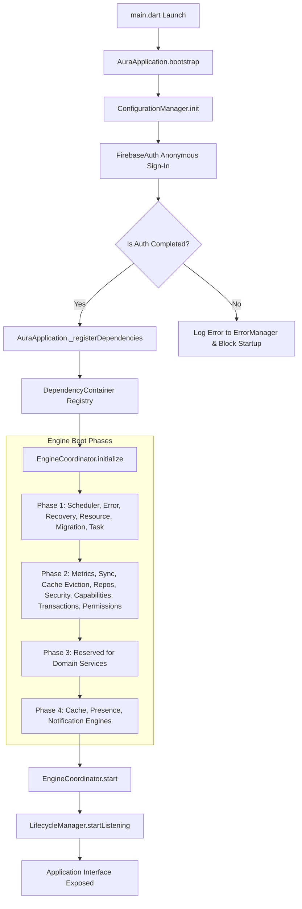

### Key Source Files:
- [main.dart](file:///d:/free_play/lib/main.dart)
- [aura_application.dart](file:///d:/free_play/lib/core/kernel/aura_application.dart)
- [configuration_manager.dart](file:///d:/free_play/lib/core/kernel/configuration_manager.dart)
- [engine_coordinator.dart](file:///d:/free_play/lib/core/kernel/engine_coordinator.dart)
- [dependency_container.dart](file:///d:/free_play/lib/core/di/dependency_container.dart)
- [lifecycle_manager.dart](file:///d:/free_play/lib/core/kernel/lifecycle_manager.dart)
- [i_engine.dart](file:///d:/free_play/lib/core/kernel/i_engine.dart)

### End-to-End Step Flow:
1. **Launch Point:** Flutter framework launches [main.dart](file:///d:/free_play/lib/main.dart) and triggers the bootstrap sequence via [AuraApplication.bootstrap()](file:///d:/free_play/lib/core/kernel/aura_application.dart).
2. **Configuration Loading:** [ConfigurationManager](file:///d:/free_play/lib/core/kernel/configuration_manager.dart) loads critical properties (e.g. settings parameters, expiry settings) from local storage caches (SharedPreferences/Hive) into system memory.
3. **Authentication Block:** Checks `FirebaseAuth.instance.currentUser`. If null, performs an anonymous login flow (`signInAnonymously()`) and blocks progress until the user details (UID) are registered, preventing identity race conditions in downstream components.
4. **Dependency Resolution:** [AuraApplication](file:///d:/free_play/lib/core/kernel/aura_application.dart) registers singletons and factories into [DependencyContainer](file:///d:/free_play/lib/core/di/dependency_container.dart).
5. **Phase-based Coordinator Setup:** [EngineCoordinator](file:///d:/free_play/lib/core/kernel/engine_coordinator.dart) runs sequential initialization loop across four phases to avoid dependency order violations:
   - **Phase 1 (Kernel):** [SchedulerEngine](file:///d:/free_play/lib/core/shared/scheduler/scheduler_engine.dart), [ErrorManager](file:///d:/free_play/lib/core/shared/error/error_manager.dart), [RecoveryManager](file:///d:/free_play/lib/core/shared/recovery/recovery_manager.dart), [ResourceManager](file:///d:/free_play/lib/core/shared/resource/resource_manager.dart), [MigrationEngine](file:///d:/free_play/lib/core/migration/migration_engine.dart), and [TaskManager](file:///d:/free_play/lib/core/task/task_manager.dart).
   - **Phase 2 (Infrastructure):** [MetricsEngine](file:///d:/free_play/lib/core/shared/metrics/metrics_engine.dart), [AdaptiveSyncEngine](file:///d:/free_play/lib/core/sync/adaptive_sync_engine.dart), [CacheEvictionEngine](file:///d:/free_play/lib/core/cache/cache_eviction_engine.dart), [ChatRepository](file:///d:/free_play/lib/domain/repositories/chat_repository.dart), [AdminRepository](file:///d:/free_play/lib/domain/repositories/admin_repository.dart), [SecurityPolicyEngine](file:///d:/free_play/lib/core/security/security_policy_engine.dart), [DeviceCapabilityEngine](file:///d:/free_play/lib/core/capability/device_capability_engine.dart), [TransactionManager](file:///d:/free_play/lib/core/transaction/transaction_manager.dart), and [PermissionEngine](file:///d:/free_play/lib/core/permission/permission_engine.dart).
   - **Phase 4 (Features):** [CacheEngine](file:///d:/free_play/lib/features/chat/engines/cache_engine.dart), [PresenceEngine](file:///d:/free_play/lib/features/chat/engines/presence_engine.dart), and [NotificationEngine](file:///d:/free_play/lib/features/chat/engines/notification_engine.dart).
6. **Execution Startup:** [EngineCoordinator.start()](file:///d:/free_play/lib/core/kernel/engine_coordinator.dart) triggers the active loop for all initialized modules. Finally, [LifecycleManager](file:///d:/free_play/lib/core/kernel/lifecycle_manager.dart) begins monitoring application lifecycle changes.

---

## 🚪 2. Authentication, Onboarding & User Registration Module

Controls anonymous sign-in checking, local onboarding flags, and user configuration setup.

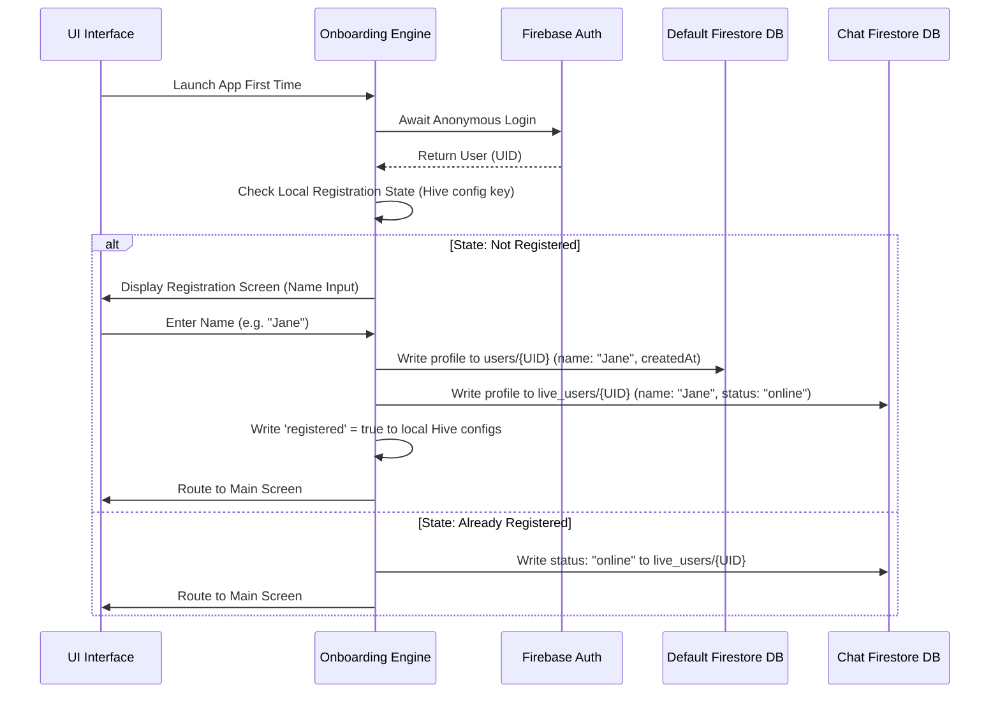

### Key Source Files:
- [local_chat_service.dart](file:///d:/free_play/lib/data/services/local_chat_service.dart)
- [user_domain_service.dart](file:///d:/free_play/lib/domain/services/user_domain_service.dart)
- [main_screen.dart](file:///d:/free_play/lib/presentation/screens/main_screen.dart)
- [fcm_token_service.dart](file:///d:/free_play/lib/data/services/fcm_token_service.dart)

### End-to-End Step Flow:
1. **Onboarding Detection:** Upon startup, the app checks if `user_name` is present in SharedPreferences. If empty, the user is navigated to an onboarding registration dialog.
2. **Profile Submission:** The user inputs their chosen handle/display name.
3. **Double-Write Registration:** The registration triggers `LocalChatService().registerUser(name)` which updates:
   - **Default Firestore Project DB (`users/{uid}` collection):** Used for public profiles and user discovery lists.
   - **Secondary Chat Firestore Instance (`live_users/{uid}` collection):** Tracks active presence state, device overrides, and custom session tokens.
4. **Presence Init:** The system executes `PresenceService().init()`, marks local flags to prevent subsequent onboarding screens, and loads [main_screen.dart](file:///d:/free_play/lib/presentation/screens/main_screen.dart).

---

## 🎵 3. Music Player, Playback Controls & Queue Module

Manages background audio streams, track transitions tracking, and recently played lists.

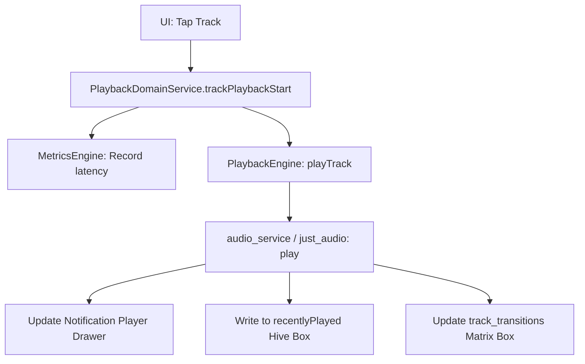

### Key Source Files:
- [playback_domain_service.dart](file:///d:/free_play/lib/domain/services/playback_domain_service.dart)
- [playback_engine.dart](file:///d:/free_play/lib/features/music/engines/playback_engine.dart)
- [audio_service.dart](file:///d:/free_play/lib/data/services/audio_service.dart)
- [queue_manager.dart](file:///d:/free_play/lib/data/services/queue_manager.dart)
- [local_taste_engine.dart](file:///d:/free_play/lib/data/services/local_taste_engine.dart)

### End-to-End Step Flow:
1. **Selection:** User triggers playback by tapping a song card.
2. **Interception:** [PlaybackDomainService](file:///d:/free_play/lib/domain/services/playback_domain_service.dart) profiles play request latency and calls [PlaybackEngine](file:///d:/free_play/lib/features/music/engines/playback_engine.dart).
3. **Queue Activation:** [QueueManager](file:///d:/free_play/lib/data/services/queue_manager.dart) structures the queue indexes, preparing next/previous track links.
4. **Hardware Driver Audio:** Audio streams are sent using the `just_audio` plugin, while background audio configurations are maintained via the `audio_service` package (providing integration with lock screen overlay menus).
5. **Listening Tracking:**
   - The song is logged to local history, adding it to the `recentlyPlayed` Hive box (which automatically evicts items when the count exceeds 50 to conserve cache space).
   - [LocalTasteEngine](file:///d:/free_play/lib/data/services/local_taste_engine.dart) updates its track transition matrices (`track_transitions` box), tracking connections between the previous and new tracks to map user affinity rules.

---

## 🔍 4. Music Search, ML Enhancement & Suggestion Module

Normalizes user search inputs with synonyms and maps multiple remote music APIs to aggregate ranked outputs.

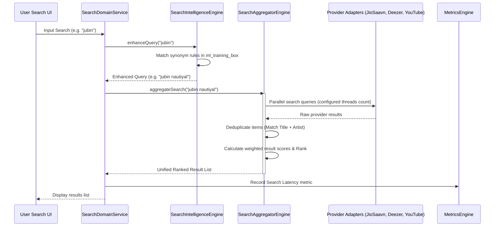

### Key Source Files:
- [search_domain_service.dart](file:///d:/free_play/lib/domain/services/search_domain_service.dart)
- [search_intelligence_engine.dart](file:///d:/free_play/lib/features/admin/engines/search_intelligence_engine.dart)
- [search_aggregator_engine.dart](file:///d:/free_play/lib/features/music/engines/search_aggregator_engine.dart)
- [multi_source_aggregator.dart](file:///d:/free_play/lib/data/datasources/remote/multi_source_aggregator.dart)
- [jiosaavn_adapter.dart](file:///d:/free_play/lib/data/services/jiosaavn_adapter.dart)
- [deezer_datasource.dart](file:///d:/free_play/lib/data/datasources/remote/deezer_datasource.dart)
- [youtube_datasource.dart](file:///d:/free_play/lib/data/datasources/remote/youtube_datasource.dart)

### End-to-End Step Flow:
1. **Search Event:** The user types a query into the UI search input bar.
2. **ML Query Expansion:** [SearchDomainService](file:///d:/free_play/lib/domain/services/search_domain_service.dart) passes the query to [SearchIntelligenceEngine](file:///d:/free_play/lib/features/admin/engines/search_intelligence_engine.dart), which replaces text using custom synonym records loaded in `ml_training_box`.
3. **Multi-Source Fetch:** [SearchAggregatorEngine](file:///d:/free_play/lib/features/music/engines/search_aggregator_engine.dart) executes parallel search operations through provider adapters. Parallel query count is limited dynamically (e.g. 1 thread on low-memory models, 3 threads on high-RAM hardware).
4. **Ranking & Merging:**
   - **Deduplication:** Merges matching song titles and artist descriptors into unified metadata objects.
   - **Weighted Scoring:** Ranks songs based on metadata similarity and audio quality scores (e.g. high weight for official tracks from JioSaavn/Deezer vs. lower weight for YouTube links).
5. **Presentation & Metrics:** The ranked output is rendered in the UI list, and overall retrieval speed is logged to the [MetricsEngine](file:///d:/free_play/lib/core/shared/metrics/metrics_engine.dart) registry.

---

## 🗄️ 5. Playlist & Library Sync Module

Implements offline-first playlist operations, local cache indexing, and dynamic database synchronization.

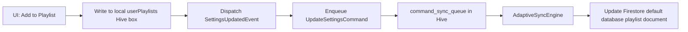

### Key Source Files:
- [playlist_provider.dart](file:///d:/free_play/lib/presentation/providers/playlist_provider.dart)
- [playlist_datasource.dart](file:///d:/free_play/lib/data/datasources/local/playlist_datasource.dart)
- [adaptive_sync_engine.dart](file:///d:/free_play/lib/core/sync/adaptive_sync_engine.dart)
- [app_command.dart](file:///d:/free_play/lib/core/commands/app_command.dart)

### End-to-End Step Flow:
1. **Mutation:** The user modifies a playlist (creates, renames, or appends tracks).
2. **L2 Local Cache Write:** [PlaylistLocalDataSource](file:///d:/free_play/lib/data/datasources/local/playlist_datasource.dart) writes changes instantly to the local `userPlaylists` Hive box for offline reading.
3. **Sync Event Enqueuing:** The app constructs an `UpdateSettingsCommand` containing the playlist details payload and writes it into the encrypted `command_sync_queue` Hive box.
4. **Sync Execution:** [AdaptiveSyncEngine](file:///d:/free_play/lib/core/sync/adaptive_sync_engine.dart) checks connection states. If a network connection is available, the sync pipeline executes the command and updates the default Firestore database. If offline, the command remains in the queue.

---

## 💾 6. Offline Downloader Module

Saves audio bytes to device storage to support playback without internet access.

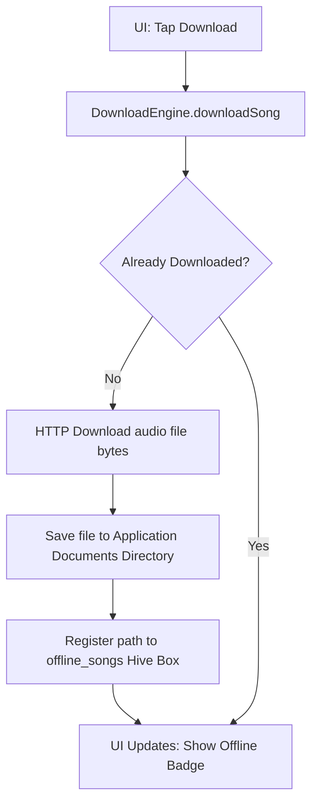

### Key Source Files:
- [download_engine.dart](file:///d:/free_play/lib/features/music/engines/download_engine.dart)
- [download_service.dart](file:///d:/free_play/lib/data/services/download_service.dart)
- [offline_storage_service.dart](file:///d:/free_play/lib/data/services/offline_storage_service.dart)

### End-to-End Step Flow:
1. **Download Request:** Tapping download on a track launches [DownloadEngine.downloadSong()](file:///d:/free_play/lib/features/music/engines/download_engine.dart).
2. **Duplicate Check:** Looks up the song ID in the `offline_songs` Hive box. If already registered, the download step is skipped.
3. **HTTP Streaming:** The downloader executes an HTTP GET request to download the track bytes.
4. **Storage Writing:** [OfflineStorageService](file:///d:/free_play/lib/data/services/offline_storage_service.dart) streams and writes the downloaded audio file directly into the device's Application Documents directory.
5. **Local Registry:** Once complete, the local file path and track metadata are registered in the `offline_songs` Hive box.
6. **Playback Routing:** During song loading, [PlaybackEngine](file:///d:/free_play/lib/features/music/engines/playback_engine.dart) verifies if the track ID exists in the `offline_songs` registry. If present, it overrides the remote streaming URL with the local file path to load the audio offline.

---

## 💬 7. Secret Chat Room Connection & Passcode Handshake Module

Integrates passcode-protected end-to-end user communication channels over the secondary Firestore instance.

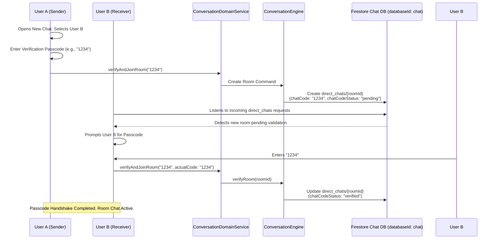

### Key Source Files:
- [secret_console_screen.dart](file:///d:/free_play/lib/presentation/screens/secret_console_screen.dart)
- [chat_room_screen.dart](file:///d:/free_play/lib/presentation/screens/chat_room_screen.dart)
- [conversation_domain_service.dart](file:///d:/free_play/lib/domain/services/conversation_domain_service.dart)
- [conversation_engine.dart](file:///d:/free_play/lib/features/chat/engines/conversation_engine.dart)
- [local_chat_service.dart](file:///d:/free_play/lib/data/services/local_chat_service.dart)

### End-to-End Step Flow:
1. **Target Selection:** User A goes to the **Secret Console** (P2P Direct Messages launcher), selects User B from the registry list, and enters a passcode (e.g. `1234`).
2. **Room Request Creation:** `LocalChatService().createChatRoom` is called, which triggers [ConversationEngine.createRoom()](file:///d:/free_play/lib/features/chat/engines/conversation_engine.dart). This registers a chat document in the **secondary Firestore database** (`databaseId: 'chat'`) under `direct_chats/{roomId}` with parameters:
   - `chatCode`: `1234`
   - `chatCodeStatus`: `pending`
   - `chatCodeCreator`: User A's ID
   - `users`: `[UserA_UID, UserB_UID]`
3. **Pending Detection:** User B's stream listener in the Secret Console screen detects an incoming pending room request where they are a member.
4. **Passcode Validation:** User B is prompted to input the chat code. If the entered code matches the `chatCode` property:
   - User B's device updates local SharedPreferences to flag this room as verified (`chat_verified_$roomId`).
   - Triggers `LocalChatService().verifyChatRoom(roomId)` to update the Firestore document's status to `verified`.
5. **Interface Activation:** Once the handshake is verified, the chat room is unlocked, allowing message history to sync and enabling message transmission.

---

## 📝 8. Chat Messaging & Database Pruning Module

Enables decoupled chat transmissions, local caching, text revisions, soft-deletions, and automatic message database pruning.

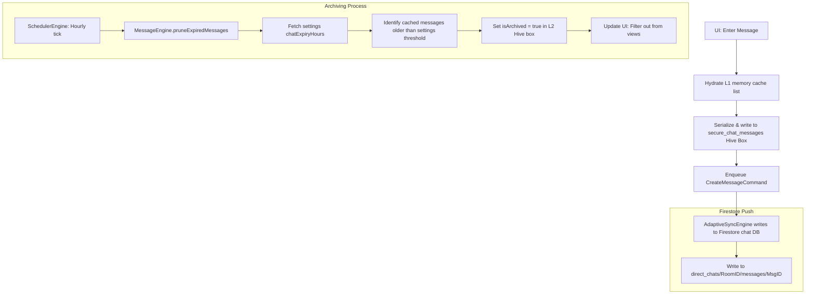

### Key Source Files:
- [chat_room_screen.dart](file:///d:/free_play/lib/presentation/screens/chat_room_screen.dart)
- [message_engine.dart](file:///d:/free_play/lib/features/chat/engines/message_engine.dart)
- [chat_commands.dart](file:///d:/free_play/lib/core/commands/chat_commands.dart)
- [chat_message_model.dart](file:///d:/free_play/lib/data/models/chat_message_model.dart)
- [scheduler_engine.dart](file:///d:/free_play/lib/core/shared/scheduler/scheduler_engine.dart)

### End-to-End Step Flow:
1. **Send Message:** The user types their text and clicks send.
2. **L1 & L2 Local Caching:** The message is instantly added to the UI controller's list (L1) and written to the local `secure_chat_messages` Hive box (L2), providing responsive updates.
3. **Queue Synchronization:** The system creates a `CreateMessageCommand` and pushes it to the sync engine, which writes the document to the messages sub-collection in the chat Firestore database.
4. **Message Interventions:**
   - **Soft Delete:** Triggers `DeleteMessageCommand`, replacing the message text with *"This message was deleted"* on both clients.
   - **Star Toggle:** Flags `isStarred = true` locally and sends an update command to the database. Starred status protects messages from automatic pruning.
5. **Periodic Message Pruning:**
   - [SchedulerEngine](file:///d:/free_play/lib/core/shared/scheduler/scheduler_engine.dart) triggers [MessageEngine.pruneExpiredMessages()](file:///d:/free_play/lib/features/chat/engines/message_engine.dart) hourly.
   - Evaluates messages against `chatExpiryHours` (defaulting to 24 hours).
   - Non-starred messages older than the threshold are flagged `isArchived = true` and updated in Firestore.
   - The UI filters out archived messages, keeping the chat screen clean.

---

## ⚡ 9. Presence & Status Management Module

Monitors device focus states to write active session status inside the Chat Firestore database.

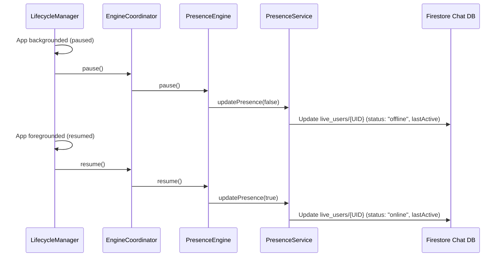

### Key Source Files:
- [lifecycle_manager.dart](file:///d:/free_play/lib/core/kernel/lifecycle_manager.dart)
- [presence_engine.dart](file:///d:/free_play/lib/features/chat/engines/presence_engine.dart)
- [presence_service.dart](file:///d:/free_play/lib/data/services/presence_service.dart)
- [local_chat_service.dart](file:///d:/free_play/lib/data/services/local_chat_service.dart)

### End-to-End Step Flow:
1. **Lifecycle Transition:** The user minimizes or re-opens the application.
2. **State Interception:** [LifecycleManager](file:///d:/free_play/lib/core/kernel/lifecycle_manager.dart) detects the WidgetsBinding transition.
3. **Engine Propagation:** Relays `pause()` or `resume()` to the coordinator, which triggers [PresenceEngine](file:///d:/free_play/lib/features/chat/engines/presence_engine.dart).
4. **Presence Registration:** Updates the user's document in the `live_users` collection:
   - **Foreground:** `status` is set to `online`, and `lastActive` is updated to the current timestamp.
   - **Background:** `status` is set to `offline`, and `lastActive` is updated to when the user left.
5. **Notification Suppression:** When navigating into a chat room, the app calls `LocalChatService().updateCurrentRoom(roomId)`. If the recipient is active inside the same room, unread badges and notification sounds are suppressed.

---

## 👑 10. Admin Module Workflows

Enables device diagnostics, training ML synonym queries, modifying database expiry parameters, and user account wiping.

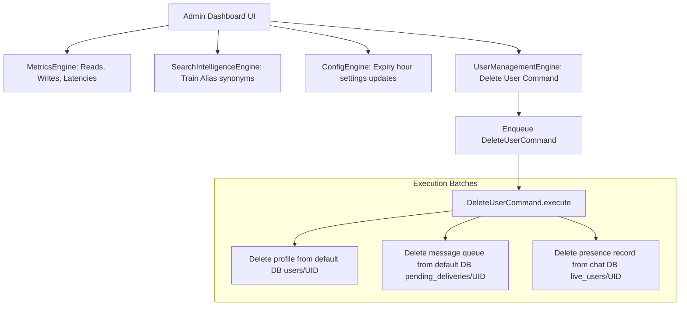

### Key Source Files:
- [ml_training_screen.dart](file:///d:/free_play/lib/presentation/screens/ml_training_screen.dart)
- [manage_users_screen.dart](file:///d:/free_play/lib/presentation/screens/manage_users_screen.dart)
- [user_management_engine.dart](file:///d:/free_play/lib/features/admin/engines/user_management_engine.dart)
- [audit_engine.dart](file:///d:/free_play/lib/features/admin/engines/audit_engine.dart)
- [admin_commands.dart](file:///d:/free_play/lib/core/commands/admin_commands.dart)
- [permission_engine.dart](file:///d:/free_play/lib/core/permission/permission_engine.dart)

### End-to-End Step Flow:
1. **Access Verification:** The system verifies the user's role against the [PermissionEngine](file:///d:/free_play/lib/core/permission/permission_engine.dart) role matrix before granting access to admin panels.
2. **Operations Dashboard:** Resolves startup duration, network read/write counts, cache performance, and network speed metrics from the [MetricsEngine](file:///d:/free_play/lib/core/shared/metrics/metrics_engine.dart) tracker.
3. **ML Synonym Training:** Admin links search alias names (e.g. `arijit` -> `arijit singh`). This enqueues a `TrainSearchRuleCommand` which saves synonyms to Hive's `ml_training_box` and syncs them to the Firestore settings collection.
4. **User Profile Wiping:**
   - Tapping delete on a user in the [ManageUsersScreen](file:///d:/free_play/lib/presentation/screens/manage_users_screen.dart) creates a `DeleteUserCommand`.
   - The command runs batch deletes across:
     1. The user's profile document in default Firestore (`users/{uid}`).
     2. Their queued messaging directories in default Firestore (`pending_deliveries/{uid}`).
     3. Their presence records in Chat Firestore (`live_users/{uid}`).
5. **Auditing:** [AuditEngine](file:///d:/free_play/lib/features/admin/engines/audit_engine.dart) logs admin actions to the local `secure_admin_audits` box and sends a `CreateAuditLogCommand` to the server.

---

## 📊 11. Diagnostics, Cache Eviction & Hardware Adaptation Module

Monitors battery saver profiles, sync queues, and database sizes to prune low-priority cached records.

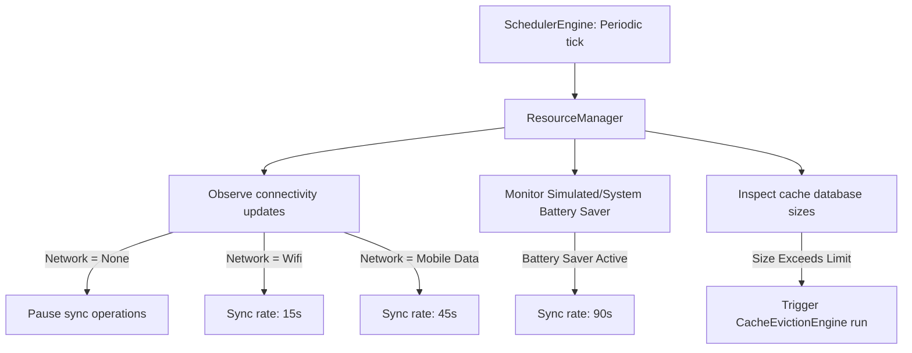

### Key Source Files:
- [resource_manager.dart](file:///d:/free_play/lib/core/shared/resource/resource_manager.dart)
- [cache_eviction_engine.dart](file:///d:/free_play/lib/core/cache/cache_eviction_engine.dart)
- [scheduler_engine.dart](file:///d:/free_play/lib/core/shared/scheduler/scheduler_engine.dart)
- [connectivity_provider.dart](file:///d:/free_play/lib/presentation/providers/connectivity_provider.dart)

### End-to-End Step Flow:
1. **Periodic Scans:** [SchedulerEngine](file:///d:/free_play/lib/core/shared/scheduler/scheduler_engine.dart) runs a periodic task every 60 seconds that executes [ResourceManager._performPeriodicResourceScan()](file:///d:/free_play/lib/core/shared/resource/resource_manager.dart).
2. **Network Sync Optimization:**
   - **No connection:** Disables synchronization tasks.
   - **Wi-Fi:** Sets a 15-second sync timer.
   - **Mobile Data:** Extends the sync timer to 45 seconds to conserve cellular data.
3. **Power Sync Optimization:** If battery saver is active, [AdaptiveSyncEngine](file:///d:/free_play/lib/core/sync/adaptive_sync_engine.dart) extends the sync interval to 90 seconds to reduce battery usage.
4. **Cache Eviction Routing:** If cache size thresholds are exceeded, the engine runs [CacheEvictionEngine.runEviction()](file:///d:/free_play/lib/core/cache/cache_eviction_engine.dart).
5. **Priority Eviction Levels:** Classifies messages in the local Hive cache to identify what can be safely removed:
   - **P1 (Current Active Chat):** Protected from eviction.
   - **P2 (Pinned Chats):** Protected from eviction.
   - **P3 (Starred Messages):** Protected from eviction.
   - **P4 (Archived Chats):** Eligible for eviction.
   - **P5 (Old Messages):** Non-starred messages older than 7 days are evicted.
   - **Unsynced Safeguard:** Unsynced messages in the local command queue are always protected from eviction.

---

## 🔦 12. Hardware Strobe Synchronization Module

Processes real-time audio playback metadata to translate frequency analysis beats into physical camera flashlight strobe flashes.

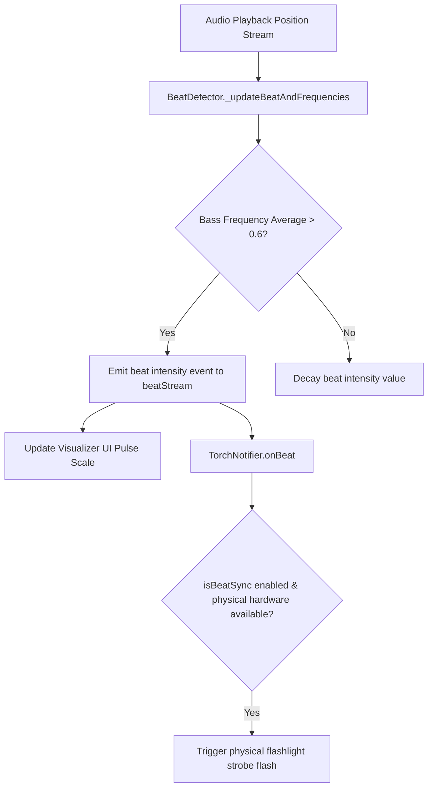

### Key Source Files:
- [beat_detector.dart](file:///d:/free_play/lib/core/services/beat_detector.dart)
- [torch_provider.dart](file:///d:/free_play/lib/presentation/providers/torch_provider.dart)
- [visualizer_screen.dart](file:///d:/free_play/lib/presentation/screens/visualizer_screen.dart)

### End-to-End Step Flow:
1. **Audio Streams Analysis:** When playing audio, the system sends frequency data updates to [BeatDetector](file:///d:/free_play/lib/core/services/beat_detector.dart).
2. **Frequency Bands Simulation:** Evaluates 64 simulation bands across bass, mid, and high frequency ranges.
3. **Beat Recognition:** If the average of the bass bands (indexes 0 to 7) exceeds a 0.6 threshold, a beat intensity event is emitted.
4. **Flashlight Synchronization:** If the user enables beat-sync mode (`isBeatSync == true`) on [VisualizerScreen](file:///d:/free_play/lib/presentation/screens/visualizer_screen.dart):
   - The screen routes beat events to the [TorchNotifier](file:///d:/free_play/lib/presentation/providers/torch_provider.dart).
   - If a rising edge with intensity > 0.35 is detected, it triggers the camera flash hardware via the `torch_light` package.
   - The flashlight turns on for a short duration (40ms to 120ms, scaled by beat intensity) and then turns off, creating a strobe light effect synced to the music.

---

## 🎤 13. Scrolling Synchronized Lyrics Module

Fetches track lyrics from multiple database integrations and matches audio timestamp offsets to highlight scroll lines in real time.

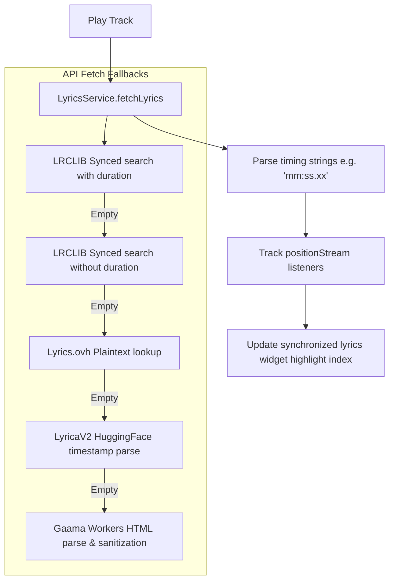

### Key Source Files:
- [lyrics_service.dart](file:///d:/free_play/lib/data/services/lyrics_service.dart)
- [lyrics_provider.dart](file:///d:/free_play/lib/presentation/providers/lyrics_provider.dart)
- [synchronized_lyrics_widget.dart](file:///d:/free_play/lib/presentation/widgets/synchronized_lyrics_widget.dart)

### End-to-End Step Flow:
1. **Request:** Loading a song triggers [LyricsService.fetchLyrics()](file:///d:/free_play/lib/data/services/lyrics_service.dart).
2. **Fallback API Searches:** The service checks multiple sources in order until lyrics are found:
   - **LRCLIB (Primary):** Searches using track duration. If no results, retries without duration.
   - **Lyrics.ovh:** Falls back to retrieving plain-text lyrics if synced lyrics are unavailable.
   - **LyricaV2 (HuggingFace):** Falls back to HuggingFace space search.
   - **Gaama Workers API:** Fetches and strips HTML tag wrappers.
3. **LRC Format Parsing:** Parses timestamps (`[mm:ss.xx]`) to map lyrics lines to duration offsets.
4. **Real-time Sync Highlights:** [lyricsProvider](file:///d:/free_play/lib/presentation/providers/lyrics_provider.dart) listens to the player's position stream. It identifies the current active line index by comparing the song's position to the line timestamps, updating the scroll view inside the [SynchronizedLyricsWidget](file:///d:/free_play/lib/presentation/widgets/synchronized_lyrics_widget.dart).

---

## 🧠 14. Local Taste Engine Module

Calculates local affinity scores offline using history co-occurrences, playlist adds, and track skips to personalize music recommendations.

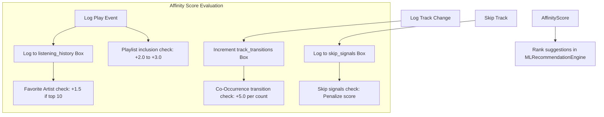

### Key Source Files:
- [local_taste_engine.dart](file:///d:/free_play/lib/data/services/local_taste_engine.dart)
- [ml_recommendation_engine.dart](file:///d:/free_play/lib/data/services/ml_recommendation_engine.dart)

### End-to-End Step Flow:
1. **Playback Event Logging:**
   - **Generic Play:** Increments the artist play count inside the `listening_history` Hive box.
   - **Track Transition:** Increments the transition co-occurrence count inside the `track_transitions` Hive box (e.g. tracks that frequently play after one another).
   - **Track Skip:** Logs skip signals if a user skips a track early in the song.
2. **Affinity Score Calculation:** Evaluates potential recommendation candidates against the seed track using a weighted scoring system:
   - **Co-occurrence (Transition Matrix):** Adds +5.0 for each time the candidate was played directly after the seed song.
   - **Artist Affinity:** Adds +1.5 if the candidate matches one of the user's top 10 most-played artists.
   - **Playlist Inclusion:** Adds +3.0 if the song is in the user's Favorites, and +2.0 if in a custom playlist.
   - **Skip Penalty:** Deducts score points if the song has history of early skip signals.
3. **Recommendation Delivery:** [MLRecommendationEngine](file:///d:/free_play/lib/data/services/ml_recommendation_engine.dart) combines the local affinity score with global collaborative filtering results to rank and sort the recommended tracks.

---

## 🗺️ 15. Geographic Region Lookup Module

Queries geographic coordinates using ip-api to support regional search filtering.

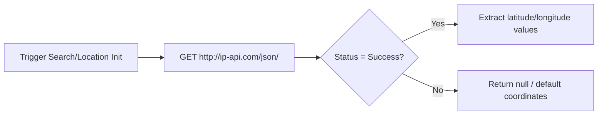

### Key Source Files:
- [ip_location_service.dart](file:///d:/free_play/lib/data/services/ip_location_service.dart)
- [hybrid_search_service.dart](file:///d:/free_play/lib/data/services/hybrid_search_service.dart)

### End-to-End Step Flow:
1. **Location Request:** The search service queries the user's region coordinates on app startup.
2. **IP Location Query:** [IpLocationService](file:///d:/free_play/lib/data/services/ip_location_service.dart) sends an HTTP request to the ip-api service to retrieve the client IP geodata.
3. **Extraction:** Parses coordinates (latitude and longitude) from the JSON response.
4. **Local Search Integration:** Coordinates are passed to regional search providers (e.g. Spotify regional client limits) to localize search query results.

---

## 🔔 16. Notification Engine Module

Registers background messaging endpoints, processes silent push notifications, and triggers interface updates.

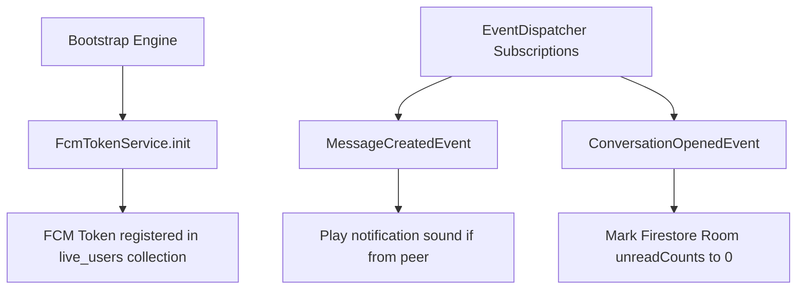

### Key Source Files:
- [notification_engine.dart](file:///d:/free_play/lib/features/chat/engines/notification_engine.dart)
- [fcm_token_service.dart](file:///d:/free_play/lib/data/services/fcm_token_service.dart)
- [event_dispatcher.dart](file:///d:/free_play/lib/core/events/event_dispatcher.dart)

### End-to-End Step Flow:
1. **FCM Registration:** [FcmTokenService](file:///d:/free_play/lib/data/services/fcm_token_service.dart) requests push permissions and retrieves the client FCM token, saving it to the user's document in the `live_users` collection.
2. **Silent Background Configuration:** Configures push notifications to run silently, allowing the application to process payloads in the background without showing system banners.
3. **Sound Playback:** [NotificationEngine](file:///d:/free_play/lib/features/chat/engines/notification_engine.dart) listens for `MessageCreatedEvent` on the event bus. If a message is received from a peer, it plays a subtle notification click sound.
4. **Unread Counter Reset:** Listening to `ConversationOpenedEvent` triggers an update to reset the room's unread badge count back to 0.

---

## 🧠 17. Device Capability & RAM Scaling Module

Profiles system memory during startup to configure local caches and search parallelism.

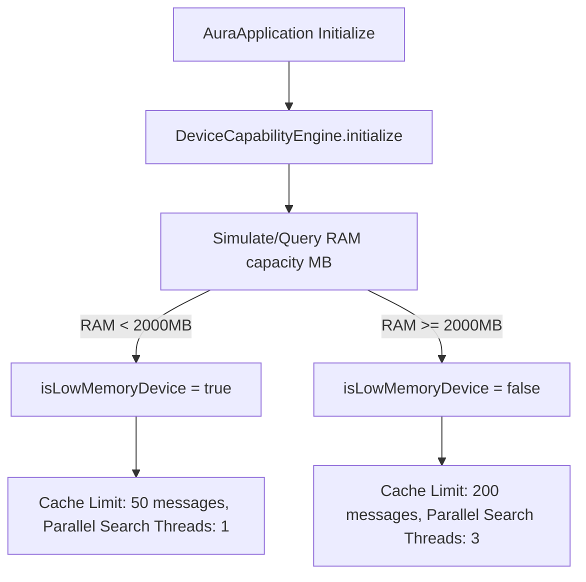

### Key Source Files:
- [device_capability_engine.dart](file:///d:/free_play/lib/core/capability/device_capability_engine.dart)
- [aura_application.dart](file:///d:/free_play/lib/core/kernel/aura_application.dart)

### End-to-End Step Flow:
1. **Profiler Startup:** [AuraApplication](file:///d:/free_play/lib/core/kernel/aura_application.dart) initializes [DeviceCapabilityEngine](file:///d:/free_play/lib/core/capability/device_capability_engine.dart) during the phase 1 boot cycle.
2. **RAM Capacity Check:** The engine reads system memory limits (defaulting to a 3GB threshold calculation on standard devices).
3. **Low-Memory Identification:** If the system has less than 2GB of RAM, it is flagged as a low-memory device (`isLowMemoryDevice = true`).
4. **Infrastructure Scaling adjustments:**
   - **Low-Memory Devices:** Cache limits are restricted to a maximum of 50 messages, and search concurrency is limited to a single thread to prevent memory exhaustion.
   - **High-Memory Devices:** Cache limits are increased to 200 messages, and search queries can run across 3 concurrent threads to improve search performance.


---

## 🔧 Technical Implementation Notes

### Configuration Screen Architecture
The configuration screen (`secret_configuration_screen.dart`) implements local device-specific overrides that take precedence over cloud settings. The `PopScope` widget manages navigation lifecycle:
- **Navigation Flow:** `PopScope(canPop: true)` → `onPopInvoked` callback → auto-save settings → pop navigation stack
- **UI Composition:** Maintains bottom navigation bar and mini player visibility through proper scaffold hierarchy
- **Data Persistence:** Settings saved to SharedPreferences immediately before navigation exit, ensuring zero data loss

### Password Synchronization Flow
Admin passwords follow a multi-layer caching strategy:
1. **Write Layer:** ML Training Screen → `ConfigurationEngine.updateSettings()` → Direct Firestore write to `app_config/map_settings`
2. **Sync Layer:** `AdaptiveSyncEngine` queues `UpdateSettingsCommand` for offline resilience
3. **Boot Fetch (Fresh Install):** `ConfigurationManager.init()` detects no cached passcodes → Forces `Source.server` Firestore fetch before any prompt is shown
4. **Boot Fetch (Returning User):** `CloudSyncService.init()` refreshes passcodes using `Source.server` on every app launch, overwriting stale local cache
5. **Validation Layer:** Password prompts read from `ConfigurationManager` cached values (fallback to hardcoded defaults only when Firestore is unreachable)

**Cache Priority:** Live Firestore server → Local cache (SharedPreferences) → Hardcoded defaults

**Key Fix:** Using `Source.server` (not `Source.serverAndCache`) ensures new devices never validate against stale or empty cache, guaranteeing they always receive the latest admin-set passwords.

### Audio Playback State Management
The audio service implements session-based playback tracking to prevent race conditions:
- **Session ID Pattern:** Each `playTrack()` call increments `_playSessionId`. Async operations validate session ID before executing
- **Cleanup Sequence:** Stop current player → 100ms delay → Check session validity → Reset if needed → Load new source
- **Error Recovery:** Detects "Platform player already exists" → Triggers `_resetPlayer()` → Dispose old instance → Create fresh AudioPlayer
- **Stale Operation Prevention:** Operations check `if (_playSessionId != currentSession) return;` at critical checkpoints

**Key Guards:**
```dart
await _audioPlayer.stop();
await Future.delayed(const Duration(milliseconds: 100));
while (_isResettingPlayer && resetWaitCount < 20) {
  await Future.delayed(const Duration(milliseconds: 50));
}
if (_playSessionId != currentSession) return;
```

### Chat User Discovery Architecture
User profiles are written to dual Firestore databases for different access patterns:

**Database 1 (Default - `(default)`):**
- Collection: `users/{uid}`
- Purpose: Global user directory, profile discovery
- Access: Cross-feature user lookups

**Database 2 (Chat - `databaseId: 'chat'`):**
- Collection: `live_users/{uid}`
- Purpose: Real-time presence, active user tracking
- Access: Chat-specific queries, presence monitoring

**Field Normalization:**
```dart
final profileData = {
  'uid': uid,
  'name': normalizedName,
  'displayName': normalizedName,
  'username': normalizedName,
  'userName': normalizedName,  // All variants for compatibility
  'lastActive': FieldValue.serverTimestamp(),
  'status': 'online',
};
```

The `resolveDisplayName()` method checks all field variants to handle legacy data and cross-platform inconsistencies.

### Firestore Database Architecture
The application uses Firebase's multi-database feature with two separate Firestore instances:

1. **Default Database (`(default)`)** - Used for:
   - User profiles (`users` collection)
   - App configuration (`app_config` collection)
   - Global search history
   - ML engine synonyms
   - Pending message deliveries

2. **Chat Database (`databaseId: 'chat'`)** - Used for:
   - Real-time presence (`live_users` collection)
   - Direct message rooms (`direct_chats` collection)
   - Message sub-collections (`direct_chats/{roomId}/messages`)

**Security Rules:** Both databases use authenticated-only access (`if request.auth != null`)

### Error Handling Patterns
The codebase implements consistent error handling across modules:
- **Try-Catch-Rethrow:** Service layer catches, logs, and rethrows for upstream handling
- **Fallback Chains:** Primary source fails → Secondary source → Tertiary source → Graceful degradation
- **Console Logging:** Emoji-prefixed logs for quick visual debugging (`[Audio] ✅`, `[Audio] ❌`, `[LocalChat] ⚠️`)

---

## 📊 Data Flow Summary

### User Registration Flow
```
User Input → SharedPreferences → Hive Cache → Firestore (Default DB users) → Firestore (Chat DB live_users) → PresenceService.init()
```

### Password Update Flow
```
ML Training Screen → ConfigurationEngine → ConfigurationManager.cacheSettings() → Firestore (app_config) → AdaptiveSyncEngine.enqueue() → Other Devices CloudSyncService.init()
```

### Song Playback Flow
```
UI Tap → PlaybackDomainService → PlaybackEngine → Session ID++ → AudioPlayer.stop() → 100ms delay → AudioPlayer.setUrl() → AudioPlayer.play()
```

### Chat Message Flow
```
User Message → L1 Memory Cache → L2 Hive Box (secure_chat_messages) → CreateMessageCommand → AdaptiveSyncEngine → Firestore (direct_chats/{roomId}/messages)
```

---

## 🚀 Performance Optimizations

### Cache Hierarchy
- **L1 (Memory):** In-memory lists for instant UI updates
- **L2 (Hive):** Local database for offline-first access
- **L3 (Firestore):** Cloud persistence with selective sync

### Network Optimization
- **Debounced Writes:** Multiple rapid changes collapsed into single Firestore write
- **Batch Operations:** Transaction-based atomic updates for chat rooms
- **Adaptive Sync:** Intervals adjust based on battery saver, network type (WiFi: 15s, Mobile: 45s, Battery Saver: 90s)

### Memory Management
- **Device Capability Profiling:** RAM detection adjusts cache limits (Low: 50 messages, High: 200 messages)
- **Play History Cap:** Last 50 tracks kept in memory for duplicate prevention
- **Cache Eviction:** Priority-based message pruning (P1: Active Chat → P5: Old Messages)

---

## 🔐 Security Architecture

### Authentication
- **Anonymous Firebase Auth:** All users sign in anonymously with persistent UIDs
- **No Password Storage:** Passcodes cached locally, never sent over network unencrypted

### Passcode Validation
- **Admin Access:** Cached in `cached_adminPasscode` SharedPreferences key (default: `Sandip_XYZ-05`)
- **App Lock:** Cached in `cached_appLockPasscode` (default: `Sandip_XYZ-05`)
- **Secret Console:** Cached in `cached_secretConsolePasscode` (default: `Hidden_2026`)

### Chat Room Security
- **Passcode Handshake:** Room creator sets code → Receiver must enter matching code → Status updates from `pending` to `verified`
- **Local Verification Flag:** `chat_verified_$roomId` stored in SharedPreferences to skip re-validation
- **Firestore Rules:** All collections require `request.auth != null`

---

## 📈 Monitoring & Debugging

### Console Log Patterns
**Success Indicators:**
- `[LocalChat] ✅ Profile synced for {uid} as {name} in BOTH databases`
- `[Audio] ✅ Playback started successfully!`
- `[CloudSync] 🔑 Configuration passcodes cached locally.`

**Warning Indicators:**
- `[Audio] ⚠️ Stop error (expected on rapid switch)`
- `[LocalChat] ⚠️ Failed to register user in Firestore`

**Error Indicators:**
- `[Audio] ❌ Primary source failed`
- `[LocalChat] ❌ Profile sync error`

**Session Validation:**
- `[Audio] ⏭️ Session changed during cleanup, aborting load`

### Metrics Tracking
The `MetricsEngine` tracks:
- Startup duration (boot time)
- Network read/write counts
- Cache hit/miss rates
- Search latency
- Playback buffer time

---

*Last Updated: July 10, 2026 - Architecture v1.0 with Stability Patches*
